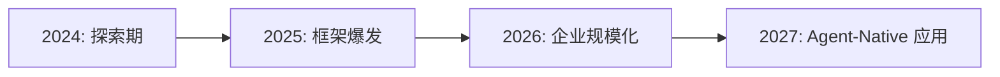

# 2026 年 AI Agent 技术趋势报告

> **作者：** 王芳 &nbsp;|&nbsp; **日期：** 2026-05-08 &nbsp;|&nbsp; **类型：** 🔗 外部链接 &nbsp;|&nbsp; **标签：** `技术` `AI`

---

## 摘要

AI Agent 正在从实验性项目走向企业级生产环境。本报告汇总了 2026 年上半年 AI Agent 领域的**关键技术进展、主流框架对比**和**企业落地案例**。

> 参考来源：[Anthropic - Building effective agents](https://www.anthropic.com/engineering/building-effective-agents) ｜ [OpenAI - A practical guide to building agents](https://platform.openai.com/docs/guides/agents)

---

## 1. 行业趋势总览

### 市场数据



| 指标 | 2024 | 2025 | 2026 (H1) |
|------|------|------|-----------|
| Agent 框架数量 | 12 | 47 | 60+ |
| 企业级部署占比 | 8% | 23% | 41% |
| 多 Agent 协作案例 | 15 | 89 | 320+ |
| MCP 工具生态 | 50+ | 800+ | 3,500+ |

### 关键信号

- **MCP (Model Context Protocol)** 成为连接 Agent 与外部工具的事实标准
- 从"单 Agent + 工具调用"演进为"多 Agent 协作 + 共享记忆"
- Agent 从辅助开发者编码延伸至**运维、客服、数据分析**等垂直场景

---

## 2. 主流框架对比

| 框架 | 编程语言 | 核心特点 | 适用场景 |
|------|----------|----------|----------|
| **LangGraph** | Python | 有向图编排、状态持久化、Human-in-the-Loop | 复杂多步骤工作流 |
| **CrewAI** | Python | 角色驱动、多 Agent 协作、任务委派 | 团队模拟、内容生产 |
| **AutoGen** | Python | 微软出品、对话驱动、代码生成执行 | 编程助手、数据分析 |
| **Agno** | Python | 轻量级、多模态、内置记忆与知识库 | 快速原型、研究实验 |
| **Mastra** | TypeScript | TS 原生、与 Vercel AI SDK 深度集成 | Web 应用、全栈项目 |

### 框架选择决策树

```
是否需要多 Agent 协作?
 ├── 是 → 需要图编排? → LangGraph
 │        角色驱动?   → CrewAI
 └── 否 → 单 Agent 够用
           ├── Python 生态 → Agno
           └── TS/Web 生态  → Mastra
```

---

## 3. 多 Agent 协作

### 协作模式

```python
# CrewAI 多 Agent 示例
from crewai import Agent, Task, Crew

# 定义角色
researcher = Agent(
    role="技术研究员",
    goal="深度调研指定技术领域的最新进展",
    backstory="你是一位资深技术研究员，擅长从海量信息中提炼关键洞察",
    tools=[web_search_tool, paper_search_tool],
    llm="claude-sonnet-4-6"
)

writer = Agent(
    role="技术作者",
    goal="将研究结果整理成结构清晰、易读的技术报告",
    backstory="你是一位优秀的技术写作者，擅长用简洁的语言解释复杂概念",
    llm="claude-opus-4-7"
)

# 编排任务
research_task = Task(
    description="调研 2026 年 RAG 技术的发展趋势",
    agent=researcher
)

writing_task = Task(
    description="基于调研结果，撰写一份 3000 字的技术报告",
    agent=writer
)

# 执行
crew = Crew(agents=[researcher, writer], tasks=[research_task, writing_task])
result = crew.kickoff()
```

### MCP 工具生态

```json
{
  "mcpServers": {
    "database": {
      "command": "npx",
      "args": ["-y", "@anthropic/mcp-server-postgres"],
      "env": { "DATABASE_URL": "postgresql://..." }
    },
    "filesystem": {
      "command": "npx",
      "args": ["-y", "@anthropic/mcp-server-filesystem"],
      "args": ["/path/to/workspace"]
    },
    "search": {
      "command": "npx",
      "args": ["-y", "@anthropic/mcp-server-brave-search"],
      "env": { "BRAVE_API_KEY": "xxx" }
    }
  }
}
```

---

## 4. 企业落地案例

### 案例一：智能运维 Agent

| 维度 | 描述 |
|------|------|
| **场景** | 告警分析、故障定位、自动修复建议 |
| **架构** | Agent → 查询 Prometheus 指标 → 分析日志 → 生成处理建议 |
| **效果** | MTTR 降低 62%，告警误报率降低 35% |

### 案例二：知识库问答 Agent

```python
# RAG + Agent 混合架构
class KnowledgeAgent:
    def __init__(self):
        self.retriever = HybridRetriever(  # ES + Qdrant 混合检索
            es_client=Elasticsearch(...),
            qdrant_client=QdrantClient(...),
            embedding_model="text-embedding-3-large"
        )
        self.llm = ChatAnthropic(model="claude-sonnet-4-6")

    def answer(self, question: str, user_context: dict) -> str:
        # Step 1: 检索相关文档
        docs = self.retriever.search(question, top_k=5)

        # Step 2: 评估文档相关性
        relevant_docs = [d for d in docs if d.score > 0.7]

        # Step 3: 生成回答
        response = self.llm.invoke(
            messages=[{
                "role": "user",
                "content": f"""Context: {relevant_docs}
Question: {question}
Instructions: Answer based on the context. If unsure, say so."""
            }]
        )
        return response.content
```

---

## 5. 挑战与展望

### 当前挑战

| 挑战 | 描述 | 缓解方案 |
|------|------|----------|
| **幻觉控制** | Agent 可能产生不准确的操作 | 约束输出格式、人工确认关键操作 |
| **成本管理** | 多 Agent 多次 LLM 调用成本高 | 模型分层（小模型预处理，大模型决策） |
| **安全边界** | Agent 自主操作可能越权 | 沙箱执行、权限分级、操作审计 |
| **可靠性** | 长链任务可能中途失败 | 检查点恢复、任务重试、Saga 补偿 |

### 2026 下半年展望

- **Agent-Native 框架成熟** — Agent 成为应用的一等公民，而非附加功能
- **MCP 2.0** — 支持双向流式通信、Agent-to-Agent 协议
- **可观测性标准化** — Agent 的 "三大支柱"（日志/指标/链路）成为基础设施标配
- **成本持续下降** — 小模型 + 推理优化，Agent 调用成本有望降低 50-70%

---

## 总结

2026 年是 AI Agent **从 Demo 走向生产**的关键一年。核心建议：

1. **从小场景切入** — 选择一个痛点明确、失败成本低的场景先试点
2. **选择合适的框架** — 不要追新，选团队熟悉、生态成熟的
3. **重视可观测性** — Agent 的调试比传统应用复杂得多
4. **关注 MCP 生态** — 它正在成为 Agent 工具交互的 HTTP 协议
