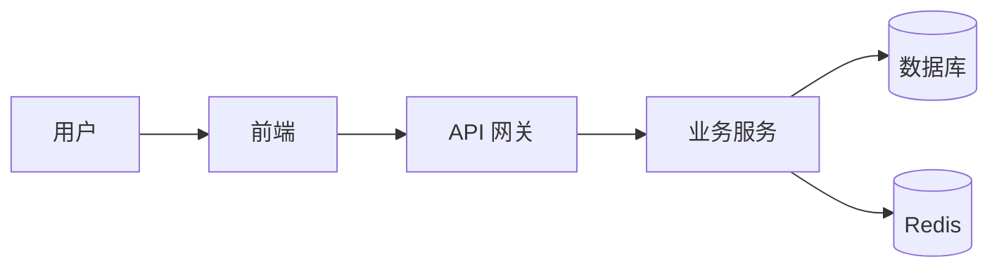

# Markdown 基础语法培训手册

## 目录

1. [简介](#简介)
2. [标题](#标题)
3. [文本样式](#文本样式)
4. [列表](#列表)
5. [链接与图片](#链接与图片)
6. [代码块](#代码块)
7. [表格](#表格)
8. [引用](#引用)
9. [分割线](#分割线)
10. [任务列表](#任务列表)
11. [脚注](#脚注)
12. [HTML 混用](#html-混用)

---

## 简介

Markdown 是一种轻量级标记语言，由 **John Gruber** 于 2004 年创建。它使用纯文本格式，可以轻松转换为 HTML。

> Markdown 的设计目标是"易读易写"——让文档的源文件读起来就像纯文本一样自然。

---

## 标题

使用 `#` 号标记标题，支持 1~6 级标题：

```markdown
# 一级标题
## 二级标题
### 三级标题
#### 四级标题
##### 五级标题
###### 六级标题
```

**渲染效果：**

# 一级标题
## 二级标题
### 三级标题
#### 四级标题
##### 五级标题
###### 六级标题

---

## 文本样式

| 语法 | 效果 |
|------|------|
| `**粗体**` | **粗体文字** |
| `*斜体*` | *斜体文字* |
| `***粗斜体***` | ***粗斜体*** |
| `~~删除线~~` | ~~删除线~~ |
| `` `行内代码` `` | `行内代码` |
| `==高亮==`（部分支持） | ==高亮文字== |
| `下标 H~2~O` | H~2~O |
| `上标 x^2^` | x^2^ |

---

## 列表

### 无序列表

```markdown
- 项目一
- 项目二
  - 子项目 2.1
  - 子项目 2.2
- 项目三
```

- 前端开发
- 后端开发
  - Java Spring Boot
  - Python FastAPI
- 运维

### 有序列表

```markdown
1. 第一步
2. 第二步
   1. 子步骤 2.1
   2. 子步骤 2.2
3. 第三步
```

1. 分析需求
2. 设计方案
   1. 技术选型
   2. 架构设计
3. 编码实现

---

## 链接与图片

### 链接

```markdown
[链接文字](https://example.com)
[带标题的链接](https://example.com "鼠标悬停时显示的标题")
<https://example.com>  ← 自动链接
```

**示例：** [GitHub](https://github.com) 是一个代码托管平台。

### 图片

```markdown


<!-- 带链接的图片 -->
[](跳转链接)
```

**示例 —— 网络图片：**


**示例 —— 本地图片：**


**带链接的图片：**

[](https://github.com)

---

## 代码块

### 行内代码

使用反引号包裹：`` `const name = "Jason";` `` → `const name = "Jason";`

### 围栏代码块

使用三个反引号，指定语言可以开启语法高亮：

````markdown
```javascript
// JavaScript 示例
function greet(name) {
    const message = `Hello, ${name}!`;
    console.log(message);
    return message;
}

greet('World');
```
````

**渲染效果：**

```javascript
// JavaScript 示例
function greet(name) {
    const message = `Hello, ${name}!`;
    console.log(message);
    return message;
}

greet('World');
```

### 更多语言示例

```python
# Python 示例
def fibonacci(n: int) -> list[int]:
    """生成斐波那契数列"""
    seq = [0, 1]
    for _ in range(n - 2):
        seq.append(seq[-1] + seq[-2])
    return seq[:n]

print(fibonacci(10))  # [0, 1, 1, 2, 3, 5, 8, 13, 21, 34]
```

```java
// Java 示例
public class Main {
    public static void main(String[] args) {
        System.out.println("Hello, Markdown!");
    }
}
```

```sql
-- SQL 示例
SELECT u.name, COUNT(o.id) AS order_count
FROM users u
LEFT JOIN orders o ON u.id = o.user_id
WHERE u.status = 'active'
GROUP BY u.id, u.name
HAVING COUNT(o.id) > 5
ORDER BY order_count DESC;
```

```json
{
  "name": "knowledge-share",
  "version": "1.0.0",
  "description": "知识分享平台",
  "keywords": ["knowledge", "sharing", "platform"]
}
```

```shell
# Shell 示例
docker compose up -d
npm run dev
git log --oneline -10
```

```yaml
# YAML 示例
server:
  port: 8080
  servlet:
    context-path: /api
spring:
  datasource:
    url: jdbc:mysql://localhost:3306/knowledge
    username: root
```

---

## 表格

```markdown
| 列1 | 列2 | 列3 |
|-----|-----|-----|
| 数据A | 数据B | 数据C |
| 数据D | 数据E | 数据F |
```

### 对齐方式

```markdown
| 左对齐 | 居中对齐 | 右对齐 |
|:-------|:------:|-------:|
| 内容   | 内容   | 内容   |
```

**渲染效果：**

| 项目 | 技术栈 | 状态 |
|:-----|:------:|-----:|
| 前端 | Vue 3 + TypeScript | 开发中 |
| 后端 | Spring Boot 3 | 已完成 |
| 数据库 | MySQL + Redis | 已完成 |
| 部署 | Docker + Nginx | 计划中 |

---

## 引用

```markdown
> 这是一级引用
>> 这是二级引用
>>> 这是三级引用
```

**渲染效果：**

> 代码是写给人看的，顺带能在机器上运行。
>
> —— *Structure and Interpretation of Computer Programs*

>> 嵌套引用示例：任何傻瓜都能写出计算机能理解的代码，优秀的程序员写出人类能理解的代码。
>>
>> —— *Martin Fowler*

---

## 分割线

使用三个或更多 `---`、`***`、`___`：

```markdown
---
***
___
```

---

## 任务列表

```markdown
- [x] 已完成任务
- [x] 已完成任务 2
- [ ] 待办任务 1
- [ ] 待办任务 2
- [ ] 待办任务 3
```

**渲染效果：**

- [x] 完成需求文档评审
- [x] 完成数据库设计
- [ ] 完成 API 接口开发
- [ ] 完成前端页面开发
- [ ] 完成集成测试

---

## 脚注

```markdown
这是一个带有脚注的句子。[^1]

[^1]: 这是脚注的内容。
```

这是一个带有脚注的句子。[^1]

[^1]: 这是脚注的详细内容——Markdown 会自动将脚注链接到底部。

---

## HTML 混用

Markdown 兼容 HTML，可以直接插入 HTML 标签：

```markdown
<div align="center">
  
  <p><b>▲ 居中展示的章鱼猫</b></p>
</div>
```

<div align="center">
  
  <p><b>居中展示的章鱼猫</b></p>
</div>

### 折叠面板

```markdown
<details>
<summary>点击展开更多内容</summary>

这里是折叠的内容。
- 可以包含列表
- 代码块
- 任意 Markdown

</details>
```

<details>
<summary>点击展开更多内容</summary>

这里是折叠的隐藏内容。

```javascript
const hidden = "这段代码默认是折叠的";
console.log(hidden);
```

</details>

### 键盘按键

使用 `<kbd>` 标签：

<kbd>Ctrl</kbd> + <kbd>C</kbd> 复制
<kbd>Ctrl</kbd> + <kbd>V</kbd> 粘贴
<kbd>Ctrl</kbd> + <kbd>Shift</kbd> + <kbd>N</kbd> 新建窗口

---

## 进阶技巧

### Emoji 表情

```markdown
:smile: :rocket: :book: :bulb: :warning: :white_check_mark:
```

:smile: :rocket: :book: :bulb: :warning: :white_check_mark:

### Mermaid 图表（部分平台支持）

````markdown

````


### 数学公式（LaTeX，部分平台支持）

```markdown
行内公式：$E = mc^2$

块级公式：
$$
\int_{a}^{b} f(x) \, dx = F(b) - F(a)
$$
```

行内公式：$E = mc^2$

块级公式：
$$
\sum_{i=1}^{n} x_i = x_1 + x_2 + \cdots + x_n
$$

---

## 总结

| 元素 | 适用场景 |
|------|----------|
| 标题 `#` | 文档结构组织 |
| 粗体 / 斜体 | 重点强调 |
| 列表 `-` `1.` | 要点罗列、步骤说明 |
| 代码块 ` ``` ` | 技术文档、API 文档 |
| 表格 | 数据对比、参数说明 |
| 图片 | 架构图、截图说明 |
| 引用 `>` | 提示、警告、引用 |
| 任务列表 `- [ ]` | 待办追踪 |
| 折叠面板 | FAQ、可选内容 |

> **小提示：** 好的 Markdown 文档 = 清晰的标题层级 + 适当的代码示例 + 必要的示意图 + 简洁的表格总结。

---

*本手册使用 Markdown 编写，欢迎在实践中参考。*
