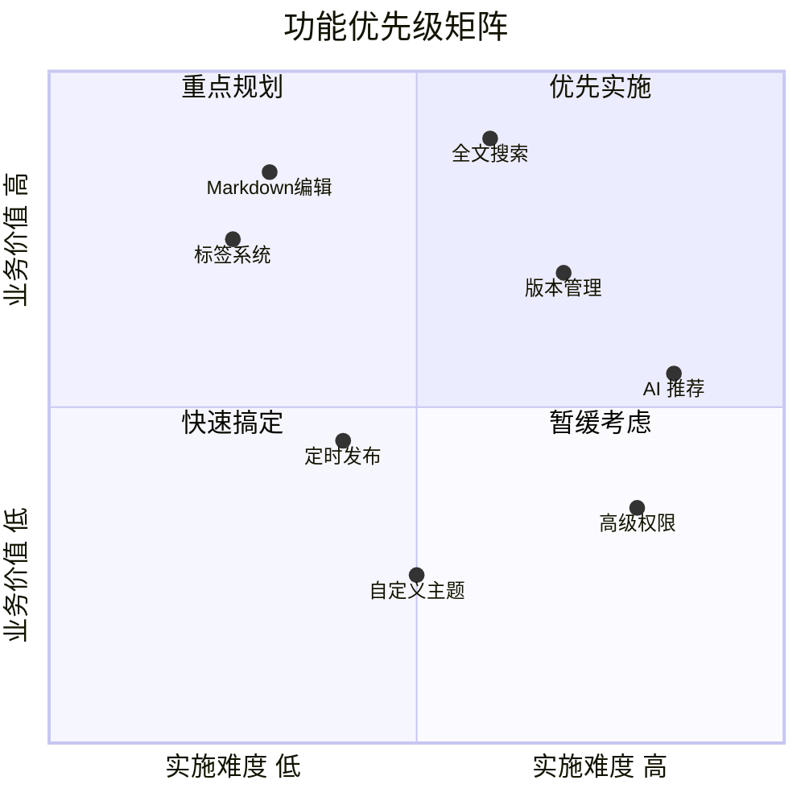

# 产品需求文档编写规范 v3.0

> **作者：** 陈静 &nbsp;|&nbsp; **日期：** 2026-05-05 &nbsp;|&nbsp; **类型：** 📎 内部引用 &nbsp;|&nbsp; **标签：** `产品` `规范`

---

## 1. 概述

### 1.1 目的

本规范定义产品需求文档（PRD）的标准结构和编写要求，旨在提升需求质量、减少沟通成本、提高交付效率。

### 1.2 适用范围

- 新产品功能需求
- 现有功能优化需求
- 技术重构需求

### 1.3 版本历史

| 版本 | 日期 | 变更内容 | 作者 |
|------|------|----------|------|
| 1.0 | 2024-06-01 | 初版 PRD 模板 | 陈静 |
| 2.0 | 2025-03-15 | 增加用户故事地图、验收标准 | 陈静 |
| 3.0 | 2026-05-01 | 增加功能优先级矩阵、NPS 预期 | 陈静 |

---

## 2. PRD 标准结构

### 2.1 文档信息

```markdown
| 字段 | 内容 |
|------|------|
| **文档名称** | XXX 产品需求文档 |
| **版本** | v1.0 |
| **作者** | 姓名 |
| **创建日期** | YYYY-MM-DD |
| **状态** | 草稿 / 评审中 / 已定稿 |
```

### 2.2 目录大纲

```
1. 项目背景与目标
2. 用户故事地图
3. 功能详细说明
4. 功能优先级矩阵
5. 非功能需求
6. 验收标准 (AC)
7. 附录
```

---

## 3. 用户故事地图

### 3.1 用户故事标准格式

> **作为** [角色]
> **我想要** [功能]
> **以便** [目的/价值]

### 3.2 示例

```markdown
## 知识分享功能 — 用户故事地图

### 活动 1：内容发布
| 用户故事 | 角色 | 优先级 |
|----------|------|--------|
| 作为员工，我想要用 Markdown 编写知识内容，以便保留格式清晰表达 | 普通用户 | P0 |
| 作为员工，我想要为内容添加标签，以便其他人能按分类找到 | 普通用户 | P1 |
| 作为员工，我想要将内容发布到特定群组，以便精准触达目标读者 | 普通用户 | P1 |
| 作为员工，我想要设置定时发布，以便在指定时间自动上线 | 普通用户 | P2 |

### 活动 2：内容审核
| 用户故事 | 角色 | 优先级 |
|----------|------|--------|
| 作为管理员，我想要审核用户提交的内容，以便保证平台内容质量 | 管理员 | P0 |
| 作为管理员，我想要驳回不合规内容并告知原因，以便作者理解问题 | 管理员 | P1 |

### 活动 3：内容发现
| 用户故事 | 角色 | 优先级 |
|----------|------|--------|
| 作为员工，我想要按标签筛选内容，以便快速找到感兴趣的知识 | 普通用户 | P1 |
| 作为员工，我想要全文搜索内容，以便精确查找特定知识 | 普通用户 | P0 |
```

---

## 4. 功能优先级矩阵

### 4.1 Eisenhower 矩阵



### 4.2 ROI 评估表

| 功能 | 开发人天 | 预期日活影响 | 技术风险 | ROI 评分 |
|------|----------|-------------|----------|----------|
| Markdown 编辑发布 | 15 | +35% | 低 | ⭐⭐⭐⭐⭐ |
| 全文搜索 | 20 | +40% | 中 | ⭐⭐⭐⭐⭐ |
| 标签系统 | 8 | +20% | 低 | ⭐⭐⭐⭐ |
| AI 内容推荐 | 30 | +15% | 高 | ⭐⭐⭐ |

---

## 5. 非功能需求（NFR）

### 5.1 性能

| 指标 | 目标值 | 测量方式 |
|------|--------|----------|
| 首页加载时间 (P95) | < 2s | Lighthouse / Web Vitals |
| API 响应时间 (P95) | < 500ms | APM 监控 |
| 搜索响应时间 (P99) | < 1s | Elasticsearch slow log |
| 并发用户数 | 500+ | JMeter 压测 |

### 5.2 安全

```yaml
security:
  authentication: JWT + Spring Security
  authorization: RBAC (角色-权限模型)
  data_protection:
    - 密码 BCrypt 加密存储
    - 敏感内容 AES-256 加密传输
    - 敏感词 AC 自动机实时过滤
  audit_log:
    - 所有内容/评论操作必须审计
    - 日志保留 180 天
```

### 5.3 可用性

| 指标 | 目标 |
|------|------|
| 系统可用性 | 99.9%（月宕机 < 43分钟） |
| 数据备份 | 每日全量 + 实时增量 |
| 灾难恢复 RTO | < 4 小时 |

---

## 6. 验收标准（AC）

### 6.1 编写原则

> 验收标准必须是**具体的、可测试的、无歧义的**。

### 6.2 模板

```markdown
## [功能名称] — 验收标准

### 正常流程
- [ ] [场景] Given [前置条件] When [用户操作] Then [预期结果]

### 异常流程
- [ ] [场景] Given [前置条件] When [异常操作] Then [预期反馈]

### 边界条件
- [ ] [场景]
```

### 6.3 实例：内容发布 AC

```markdown
## 内容发布 — 验收标准

### 正常流程
- [ ] **Markdown 发布** Given 用户已登录 When 用户输入 Markdown 正文并点击"发布"
      Then 内容保存成功，页面跳转至内容详情，内容状态为"已发布"
- [ ] **标签关联** Given 用户正在创建内容 When 用户选择 3 个标签并发布
      Then 内容详情页显示这 3 个标签，标签筛选可找到该内容

### 异常流程
- [ ] **标题为空** Given 用户已登录 When 用户未填标题点击"发布"
      Then 标题输入框标红，提示"请输入标题"
- [ ] **内容为空** Given 用户已登录 When 用户未输入正文点击"发布"
      Then 编辑器标红，提示"内容不能为空"

### 边界条件
- [ ] **标题长度** 标题最长 256 字符，超出时提示"标题不能超过 256 字符"
- [ ] **正文大小** 单篇内容最大 10MB（含图片），超出时提示"内容过大"
- [ ] **标签数量** 最少 1 个标签，最多 5 个标签
```

---

## 7. 附录

### A. PRD 自检清单

- [ ] 项目背景是否清晰表达了"为什么要做"？
- [ ] 目标是否可量化？（SMART 原则）
- [ ] 用户故事是否覆盖了主要场景？
- [ ] 每个功能是否有明确的验收标准？
- [ ] 非功能需求是否明确？（性能、安全、兼容性）
- [ ] 是否有依赖项识别和风险评估？
- [ ] 是否获得了相关干系人的 Review？

### B. 常用工具

| 工具 | 用途 |
|------|------|
| Notion / Confluence | PRD 文档协作 |
| Figma / FigJam | 用户故事地图、用户旅程 |
| Miro | 跨部门需求对齐工作坊 |
| Jira / Linear | 需求拆解与任务跟踪 |

---

> **本规范适用于团队内所有产品需求文档的编写，请在实际使用中持续迭代优化。**
