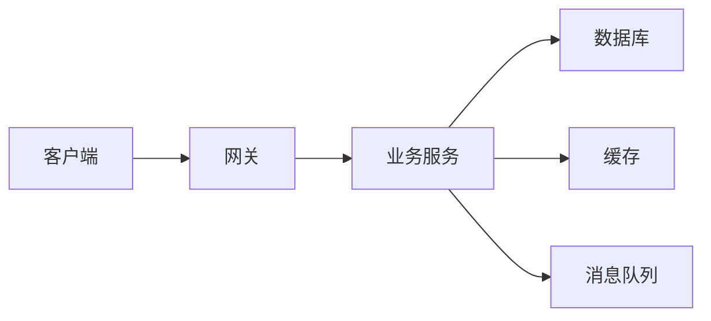
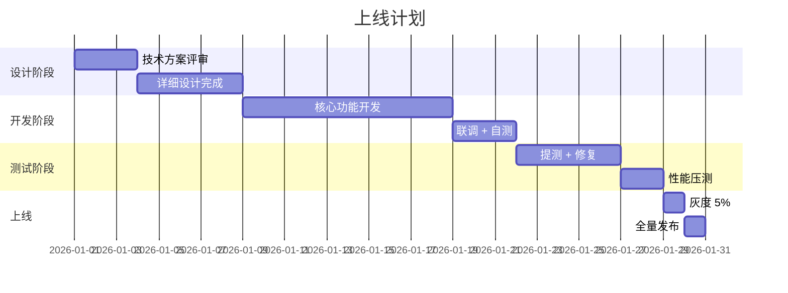

# 技术文档模板

> 系统预置模板 · 包含背景、方案、实现细节等结构

---

## 文档概述

| 字段 | 内容 |
|------|------|
| **文档标题** | [填写技术方案/文档标题] |
| **作者** | [姓名] |
| **日期** | YYYY-MM-DD |
| **类别** | 技术方案 / 调研报告 / 问题复盘 / 开发指南 |
| **状态** | 草稿 / 评审中 / 已定稿 |

---

## 1. 背景与目标

### 1.1 背景

> [为什么要做这件事？遇到了什么问题？有什么约束？]

### 1.2 目标

- [ ] [可量化的目标 1]
- [ ] [可量化的目标 2]

---

## 2. 方案设计

### 2.1 整体架构

```
[在此插入架构图，推荐使用 Mermaid 或图片]
```



### 2.2 核心流程

```
时序图 / 流程图 — 描述核心交互流程
```

### 2.3 数据库设计

```sql
CREATE TABLE IF NOT EXISTS `example` (
  id BIGINT AUTO_INCREMENT PRIMARY KEY,
  name VARCHAR(128) NOT NULL,
  status VARCHAR(16) NOT NULL DEFAULT 'ACTIVE',
  created_at DATETIME DEFAULT CURRENT_TIMESTAMP,
  updated_at DATETIME DEFAULT CURRENT_TIMESTAMP ON UPDATE CURRENT_TIMESTAMP,
  INDEX idx_status (status)
) ENGINE=InnoDB DEFAULT CHARSET=utf8mb4;
```

### 2.4 接口设计

```yaml
POST /api/example
  Request:
    name: string (required)
    description: string (optional)
  Response:
    200: { code: 200, data: { id: 1 } }
    400: { code: 400, message: "参数错误" }
```

---

## 3. 关键技术点

### 3.1 [关键技术点 1]

> [描述技术难点、选型理由、注意事项]

```java
// 示例代码
@Service
public class ExampleService {
    public Result process(ExampleRequest req) {
        // 核心处理逻辑
    }
}
```

### 3.2 [关键技术点 2]

> [描述技术难点、选型理由、注意事项]

---

## 4. 测试策略

| 测试类型 | 覆盖内容 | 预估工作量 |
|----------|----------|------------|
| 单元测试 | Service / Util 核心逻辑 | X 人天 |
| 集成测试 | API + DB + MQ 集成流程 | X 人天 |
| 性能测试 | 核心链路压测 | X 人天 |

---

## 5. 风险与应对

| 风险 | 影响 | 概率 | 应对方案 |
|------|------|------|----------|
| [风险 1] | 高/中/低 | 高/中/低 | [应对措施] |
| [风险 2] | 高/中/低 | 高/中/低 | [应对措施] |

---

## 6. 上线计划

### 里程碑



### 回滚方案

- [触发条件]: [回滚步骤]

---

## 7. 参考

- [相关文档链接]
- [外部参考材料]

---

> **提示：** 填写此模板时，请删除所有方括号中的提示文字。对于不适用的章节，标注"不适用"即可。
