# Knowledge Share 知识共享平台 — 架构与设计文档

> **版本:** 2026-05-27 | **状态:** 当前

---

## 目录

1. [系统概述](#1-系统概述)
2. [架构设计](#2-架构设计)
3. [模块设计](#3-模块设计)
4. [数据流设计](#4-数据流设计)
5. [数据库设计](#5-数据库设计)
6. [性能设计](#6-性能设计)
7. [安全设计](#7-安全设计)

---

## 1. 系统概述

Knowledge Share 是一个企业知识管理平台，支持内容创作、协作、搜索和治理。用户可以创建按群组和标签组织的 Markdown 内容，平台提供全文+向量混合搜索、评论讨论、收藏、通知以及管理员控制的审核工作流。

### 技术栈

| 层次 | 技术 | 版本 |
|------|------|------|
| 前端 | Vue 3 (Composition API) + Vite + Element Plus + Pinia | Vite 8, Vue 3.5 |
| 后端 | Spring Boot + MyBatis-Plus | Boot 3.2.0, MP 3.5.5 |
| 认证 | JWT (jjwt HMAC-SHA256) | 0.11.5 |
| 数据库 | MySQL | 8.0 |
| 缓存 | Redis | 6.x |
| 全文搜索 | Elasticsearch + IK 中文分词器 | 8.11.0 |
| 向量搜索 | Qdrant (gRPC, 余弦相似度, 768维) | 1.9.1 |
| 消息队列 | RabbitMQ (Topic Exchange) | 3.x |
| 对象存储 | MinIO | latest |
| 加密 | SM4 (国密) CBC/PKCS7 via BouncyCastle | 1.78 |

---

## 2. 架构设计

### 2.1 系统架构总览

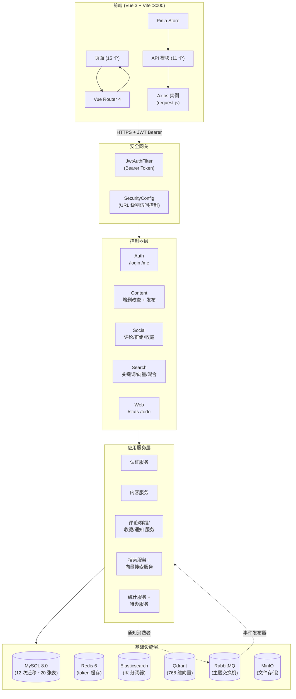

### 2.2 模块依赖图

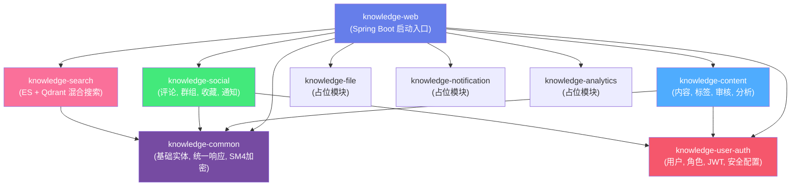

### 2.3 包结构（DDD 精简版分层）

每个模块遵循一致的分层架构：

```
模块名/
├── interfaces/
│   └── controller/     ← @RestController, 请求/响应映射
├── application/
│   ├── service/        ← @Service, 业务逻辑编排
│   └── dto/            ← 请求/响应 DTO (带 @Valid 校验注解)
├── domain/
│   ├── model/          ← 实体, 领域对象, 枚举
│   └── repository/     ← 仓储接口 (领域契约)
└── infrastructure/
    ├── mapper/         ← MyBatis-Plus @Mapper 接口
    ├── repository/     ← 仓储实现类
    ├── mq/             ← RabbitMQ 配置, 事件发布器, 消费者
    ├── elasticsearch/  ← ES 客户端配置和操作
    └── vector/         ← Qdrant 客户端配置, 向量化服务
```

---

## 3. 模块设计

### 3.1 knowledge-common — 公共基础

**职责:** 所有模块共享的横切关注点。

| 组件 | 位置 | 职责 |
|------|------|------|
| `BaseEntity` | `common/base/` | 自增 ID + 创建/更新时间戳自动填充 |
| `Result<T>` | `common/result/` | 统一 API 响应 `{code, message, data}` |
| `PageResult<T>` | `common/result/` | 分页响应，含 `total`, `page`, `size` |
| `BizException` | `common/exception/` | 领域异常，映射 HTTP 状态码 |
| `GlobalExceptionHandler` | `common/exception/` | `@ControllerAdvice` 统一异常处理 |
| `MyBatisPlusConfig` | `common/config/` | 分页拦截器 + 时间戳自动填充 |
| `SM4Util` | `common/util/` | SM4/CBC/PKCS7 加密解密 (BouncyCastle) |

### 3.2 knowledge-user-auth — 认证与授权

**职责:** 用户身份管理、基于角色的访问控制、JWT 令牌管理。

**核心组件:**

| 组件 | 职责 |
|------|------|
| `AuthController` | `POST /login` 登录, `GET /me` 获取当前用户 |
| `UserController` | 管理员用户管理 |
| `AuthService` | 登录校验, JWT 生成, 当前用户查询 |
| `JwtUtil` | HMAC-SHA256 令牌签名/验证, 可配置过期时间 |
| `JwtAuthFilter` | `OncePerRequestFilter` — 提取 Bearer 令牌, 设置 SecurityContext |
| `SecurityConfig` | URL 级别授权规则, BCrypt 加密, CORS 配置, 无状态会话 |

**安全规则:**
- `GET/POST /api/auth/**` — 已认证
- `/api/admin/**` — `hasRole("ADMIN")`
- 所有其他请求 — 已认证
- `/api/auth/login` — 允许匿名

### 3.3 knowledge-content — 内容生命周期

**职责:** 核心内容管理 — 创建、发布、版本管理、审核。

**内容状态机:**
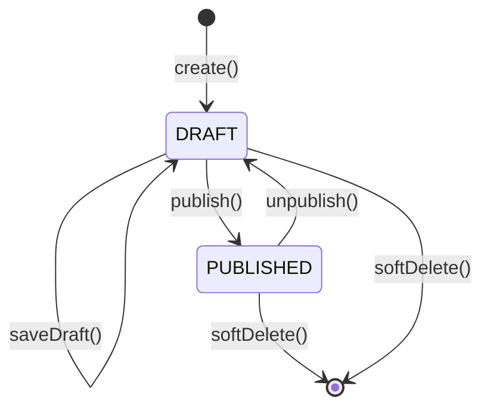

**子领域:**
- **标签管理:** 全局标签池（含颜色），内容-标签多对多关联
- **敏感词检测:** Aho-Corasick 自动机实现实时文本扫描
- **内容版本:** 每次保存生成快照并分配版本号
- **审核记录:** PENDING → APPROVED/REJECTED 工作流
- **内容模板:** 预置 Markdown 模板
- **定时发布:** 未来时间发布，带状态追踪
- **数据分析:** 用户行为日志、内容统计、搜索热词

### 3.4 knowledge-social — 社区功能

**职责:** 用户互动 — 评论、收藏、群组、通知。

**评论系统模型:**
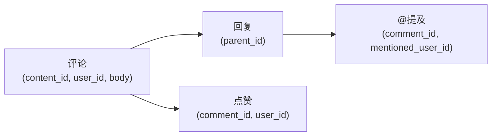

**通知事件流:**
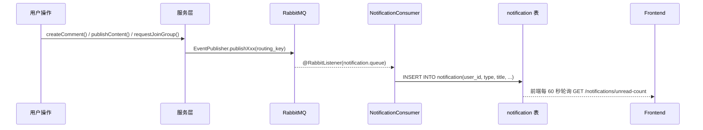

### 3.5 knowledge-search — 混合搜索

**职责:** 全文检索 + 语义搜索 + 结果融合。

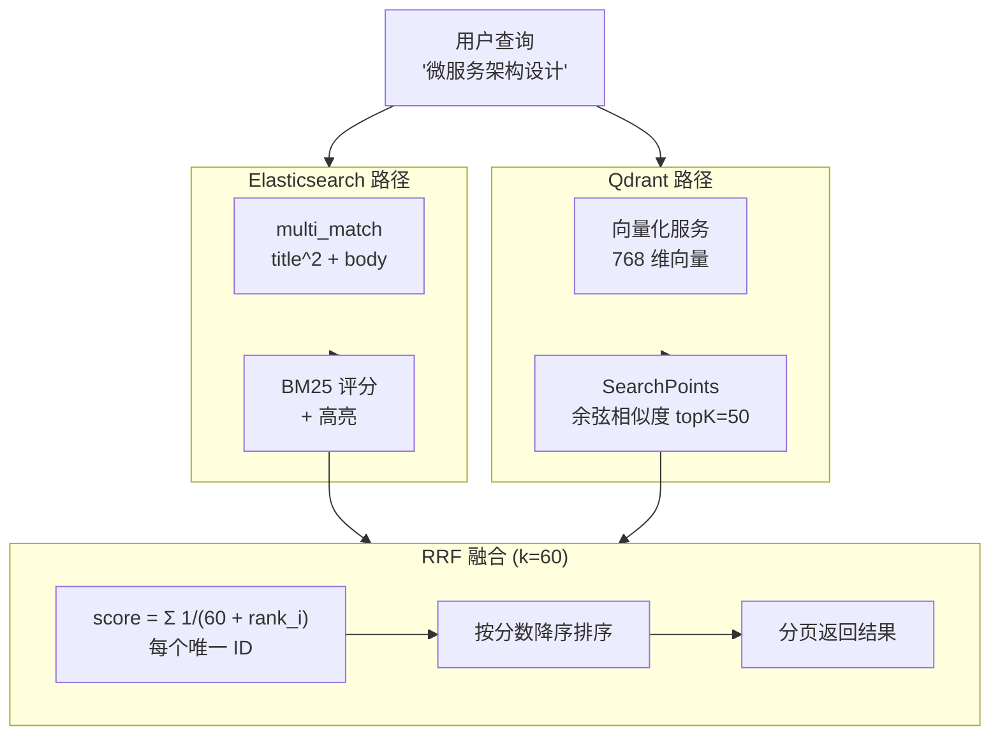

**索引设计:**
- ES 映射: `title` (ik_max_word/ik_smart), `body` (ik_max_word/ik_smart), `contentType` (keyword), `publishedAt` (date)
- Qdrant: 768 维向量, 余弦距离, payload 含 title/body 用于后续检索

### 3.6 knowledge-web — 聚合模块

**职责:** Spring Boot 启动入口, 跨模块数据聚合（统计和待办）。

- `StatsController` — 平台级聚合统计（公开, 需认证）
- `TodoController` — 用户专属待办计数：草稿、审批、审核、通知
- `DataGenerator` — 测试数据生成器（50万内容, 200万评论, 可配置规模）
- `EncryptedPropertyPostProcessor` — 启动时自动解密 `SM4(...)` 加密的配置值

---

## 4. 数据流设计

### 4.1 内容列表加载（最高频路径）

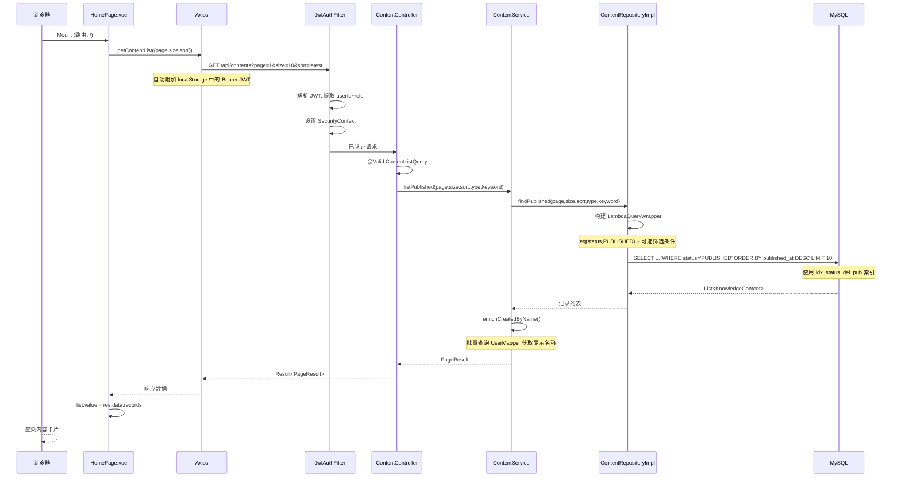

### 4.2 搜索流程

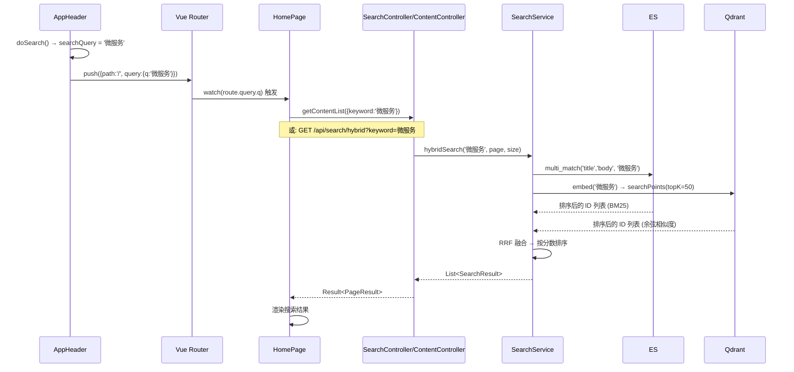

### 4.3 通知投递流程


---

## 5. 数据库设计

### 5.1 表清单（20 张表，12 次 Flyway 迁移）

| 迁移 | 表 | 用途 |
|------|----|------|
| V1 | `user`, `department`, `role`, `permission`, `user_role`, `role_permission` | 认证与身份 |
| V2 | `knowledge_content`, `content_group_relation` | 核心内容 |
| V3 | `group_info`, `group_member` | 社区群组 |
| V4 | `tag`, `content_tag_relation` | 标签系统 |
| V5 | `comment`, `comment_like`, `comment_mention` | 评论讨论 |
| V6 | `sensitive_word` | 内容审核 |
| V7 | `favorite` | 收藏 |
| V8 | `notification` | 用户通知 |
| V9 | `content_version`, `audit_record`, `content_template`, `scheduled_publish` | 内容工具链 |
| V10 | `user_action_log`, `content_stats`, `search_hot_keyword` | 数据分析 |
| V11 | (仅索引变更) | 查询优化 |
| V12 | (仅索引变更) | COUNT 优化 |

### 5.2 实体关系图

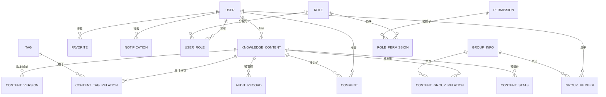

---

## 6. 性能设计

### 6.1 索引策略

**knowledge_content（主要查询目标表，50万+ 行）:**

| 索引名 | 列 | 查询场景 | 优化效果 |
|--------|----|----------|----------|
| PRIMARY | (id) | 按 ID 精确查找 | 直接访问 |
| `idx_created_by` | (created_by) | 我的草稿、我的内容 | 按作者过滤 |
| `idx_created_at` | (created_at) | 今日内容统计 | 范围扫描替代全表扫描 |
| `idx_status_del_pub` | (status, is_deleted, published_at) | 内容列表 + COUNT | 纯索引扫描计数, 无需回表 |
| `idx_status_type_pub` | (status, content_type, published_at) | 带类型筛选的列表 | 复合过滤 + 排序 |

**group_member（5万+ 行）:**

| 索引名 | 列 | 查询场景 |
|--------|----|----------|
| `uk_group_user` | (group_id, user_id) UNIQUE | 检查是否群成员 |
| `idx_user_status` | (user_id, status) | 我加入的群 |
| `idx_group_status` | (group_id, status) | 待审批入群计数 |

**group_info:**

| 索引名 | 列 | 查询场景 |
|--------|----|----------|
| `idx_owner` | (owner_id) | 我管理的群 |
| `idx_visibility_status` | (visibility, status) | 公开群组列表 |

**notification:**

| 索引名 | 列 | 查询场景 |
|--------|----|----------|
| `idx_user_read` | (user_id, is_read) | 未读计数、通知列表 |
| `idx_created` | (created_at DESC) | 最近通知 |

### 6.2 查询优化决策

**决策一：删除 `idx_is_deleted`。** 该索引基数仅为 2（0 和 1），99% 以上的行值为 0。MySQL 优化器永远不会选择它，反而可能误导查询计划器选择错误的执行路径。由包含 `is_deleted` 列的新复合索引 `idx_status_del_pub` 替代。

**决策二：纯索引 COUNT 扫描。** `SELECT COUNT(*) FROM knowledge_content WHERE status='PUBLISHED' AND is_deleted=0` 查询在每次页面加载时执行（MyBatis-Plus `selectPage` 先执行计数）。将 `is_deleted` 与 `status` 放入同一复合索引后，MySQL 可以完全在索引 B-tree 内完成计数，无需访问表行。

**决策三：为常见筛选+排序模式设计复合索引。** `(status, content_type, published_at)` 覆盖"按类型筛选已发布内容并按发布时间排序"这一最高频查询。`(visibility, status)` 覆盖公开群组列表查询。

### 6.3 前端缓存

| 缓存项 | 位置 | 有效期 | 目的 |
|--------|------|--------|------|
| 群组列表 | `api/group.js` 内存 | 3 分钟 | 避免重复请求群组列表（筛选下拉中使用） |
| 标签列表 | `api/tag.js` 内存 | 5 分钟 | 避免重复请求标签（标签选择器使用） |

### 6.4 连接池与超时配置

| 配置项 | 值 | 原因 |
|--------|----|------|
| Axios 超时 | 15s | 防止挂起的请求阻塞 UI |
| `rewriteBatchedStatements=true` | JDBC URL | 启用 MySQL 批量 INSERT 优化 |
| MyBatis-Plus 分页方式 | 物理分页 | `selectPage` 含计数优化，非内存分页 |

---

## 7. 安全设计

### 7.1 认证流程

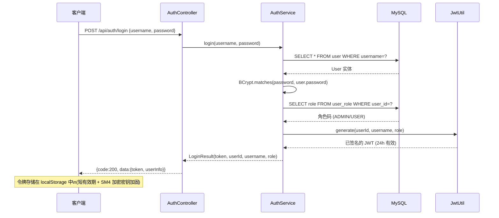

### 7.2 授权机制（纵深防御三层）

```
第一层: URL 模式匹配 (SecurityConfig)
  ├── /api/admin/**  → 需要 ROLE_ADMIN 角色
  ├── /api/auth/login → 允许匿名访问
  └── /** → 需要认证

第二层: 数据所有权校验 (Service 层)
  ├── 通知: 校验 notification.userId == currentUserId
  ├── 内容编辑: 校验 content.createdBy == currentUserId
  ├── 评论删除: 校验 comment.userId == currentUserId
  └── 群组管理: 校验 group.ownerId == currentUserId

第三层: 方法参数校验 (@Valid DTOs)
  ├── 内容类型枚举校验
  ├── 字符串长度限制 (@Size, @NotBlank)
  └── 枚举值约束 (@Pattern)
```

### 7.3 SM4 加密配置方案

**问题:** 数据库密码、JWT 密钥、RabbitMQ/MinIO 凭证等敏感值曾以明文形式硬编码在 `application.yml` 中并提交至 git。

**方案:** 使用 SM4/CBC/PKCS7Padding 对存储中的敏感值加密，应用启动时自动解密。

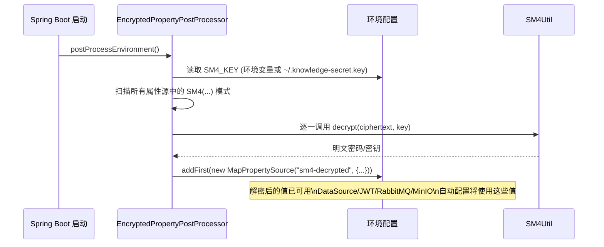

**密钥管理:**
- 主密钥: 128 位 SM4 密钥（十六进制编码，32 字符）
- 存储方式: 单一环境变量 `SM4_KEY` 或文件 `~/.knowledge-secret.key`
- 轮换流程: 通过 `SM4Util genkey` 生成新密钥 → `SM4Util encrypt <key> <value>` 逐个加密 → 更新 `application.yml`

### 7.4 已修复的漏洞

| 漏洞 | 修复措施 | 验证方式 |
|------|----------|----------|
| git 中硬编码密钥 | SM4 加密后存于 application.yml, 密钥通过环境变量传入 | 所有 `SM4(...)` 值需要 SM4_KEY 才能解密 |
| 通知接口 IDOR 漏洞 | 所有权校验: `notification.userId == auth.getPrincipal()` | `NotificationController` 传递 `Authentication` 至服务层 |
| `/auth/me` 泄露 SSO ID 和邮箱 | 返回前清空 `ssoId` 和 `email` | `AuthService.getCurrentUser()` 清除敏感字段 |
| 未校验的请求体 | `@Valid` DTO + `@NotBlank`/`@Size`/`@Pattern` 注解 | 所有控制器使用经验证的 DTO |
| SQL 注入 | MyBatis-Plus `LambdaQueryWrapper`（参数化查询） | 全代码库零 SQL 字符串拼接 |
| Markdown XSS 攻击 | `DOMPurify.sanitize(marked(raw))` 在 `v-html` 前执行 | ContentDetail.vue:106 |
| REST API CSRF 攻击 | 已禁用（无状态 JWT，不使用 Cookie） | `SecurityConfig` 无状态会话策略 |
| SQL 查询日志泄露 | 移除 `StdOutImpl` MyBatis 日志 | 生产配置无 log-impl 设置 |
| 路径遍历攻击 | Axios 编码路径参数，后端使用类型化路径变量 | `@PathVariable Long id` 类型检查 |

### 7.5 JWT 令牌配置

| 属性 | 值 | 设计理由 |
|------|----|----------|
| 签名算法 | HMAC-SHA256 | 行业标准，满足内部使用需求 |
| 签名密钥 | SM4 加密存储，256+ 位 | 强密钥，不在任何位置以明文暴露 |
| 过期时间 | 24 小时 (86400000ms) | 安全性与用户体验平衡，暂无刷新令牌 |
| 前端存储 | localStorage | 短有效期 + 无第三方脚本环境下可接受 |
| 传输方式 | `Authorization: Bearer <token>` 请求头 | 标准做法，天然免疫 CSRF |

### 7.6 访问控制矩阵

| 接口模式 | 匿名 | 普通用户 | 管理员 |
|---------|------|---------|--------|
| `POST /api/auth/login` | ✅ | ✅ | ✅ |
| `GET /api/contents/**` | — | ✅ | ✅ |
| `POST /api/contents` | — | ✅ | ✅ |
| `PUT /api/contents/{id}` | — | 仅作者 | ✅ |
| `DELETE /api/contents/{id}` | — | 仅作者 | ✅ |
| `POST /api/groups` | — | ✅ | ✅ |
| `PUT /api/groups/{id}/members/{uid}` | — | 仅群主 | ✅ |
| `GET /api/admin/**` | — | — | ✅ |
| `GET /api/stats/overview` | — | ✅ | ✅ |
| `GET /api/todo/counts` | — | ✅ (仅本人数据) | ✅ |
| `GET /api/notifications` | — | 仅本人 | 仅本人 |
| `PUT /api/notifications/{id}/read` | — | 仅本人 | 仅本人 |

---

## 附录 A：前端路由表

| 路径 | 组件 | 需要认证 | 仅管理员 |
|------|------|---------|---------|
| `/login` | LoginPage | 否 | 否 |
| `/` | HomePage (统计+待办+内容流) | 是 | 否 |
| `/content/create` | ContentCreate | 是 | 否 |
| `/content/:id` | ContentDetail | 是 | 否 |
| `/content/:id/edit` | ContentEdit | 是 | 否 |
| `/groups` | GroupList | 是 | 否 |
| `/group/:id` | GroupDetail | 是 | 否 |
| `/group/:id/manage` | GroupManage | 是 | 仅群主 |
| `/favorites` | FavoritesPage | 是 | 否 |
| `/notifications` | NotificationsPage | 是 | 否 |
| `/templates` | TemplatesPage | 是 | 否 |
| `/admin/tags` | TagManage | 是 | 是 |
| `/admin/users` | UserManage | 是 | 是 |
| `/admin/sensitive-words` | SensitiveWordManage | 是 | 是 |
| `/admin/analytics` | AnalyticsDashboard | 是 | 是 |
| `/admin/audit` | AuditCenter | 是 | 是 |
| `/admin/departments` | DepartmentManage | 是 | 是 |
| `/admin/settings` | SystemSettings | 是 | 是 |

## 附录 B：API 接口统计

| 模块 | 接口数 | 公开 | 需认证 | 仅管理员 |
|------|--------|------|--------|---------|
| 认证 | 2 | 1 | 1 | 0 |
| 用户管理 | 3 | 0 | 0 | 3 |
| 内容 | 9 | 2 | 9 | 0 |
| 标签 | 6 | 2 | 0 | 4 |
| 评论 | 6 | 0 | 6 | 0 |
| 收藏 | 4 | 0 | 4 | 0 |
| 群组 | 8 | 0 | 8 | 0 |
| 通知 | 5 | 0 | 5 | 0 |
| 搜索 | 3 | 0 | 3 | 0 |
| 敏感词 | 5 | 0 | 0 | 5 |
| 数据分析 | 4 | 0 | 0 | 4 |
| 内容工具链 | 12 | 0 | 6 | 6 |
| 聚合模块 (Stats/Todo) | 2 | 0 | 2 | 0 |
| **合计** | **69** | **5** | **46** | **18** |
