# Knowledge Share Platform — Architecture & Design Document

> **Version:** 2026-05-27 | **Status:** Current

---

## Table of Contents

1. [System Overview](#1-system-overview)
2. [Architecture Design](#2-architecture-design)
3. [Module Design](#3-module-design)
4. [Data Flow Design](#4-data-flow-design)
5. [Database Design](#5-database-design)
6. [Performance Design](#6-performance-design)
7. [Security Design](#7-security-design)

---

## 1. System Overview

Knowledge Share is an enterprise knowledge management platform supporting content creation, collaboration, search, and governance. Users create Markdown content organized by groups and tags, with full-text + vector hybrid search, comment discussions, favorites, notifications, and an admin-controlled audit workflow.

### Technology Stack

| Layer | Technology | Version |
|-------|-----------|---------|
| Frontend | Vue 3 (Composition API) + Vite + Element Plus + Pinia | Vite 8, Vue 3.5 |
| Backend | Spring Boot + MyBatis-Plus | Boot 3.2.0, MP 3.5.5 |
| Auth | JWT (jjwt HMAC-SHA256) | 0.11.5 |
| Database | MySQL | 8.0 |
| Cache | Redis | 6.x |
| Full-text Search | Elasticsearch + IK Analyzer | 8.11.0 |
| Vector Search | Qdrant (gRPC, cosine, 768-dim) | 1.9.1 |
| Message Queue | RabbitMQ (Topic Exchange) | 3.x |
| Object Storage | MinIO | latest |
| Encryption | SM4 (国密) CBC/PKCS7 via BouncyCastle | 1.78 |

---

## 2. Architecture Design

### 2.1 System Architecture Overview

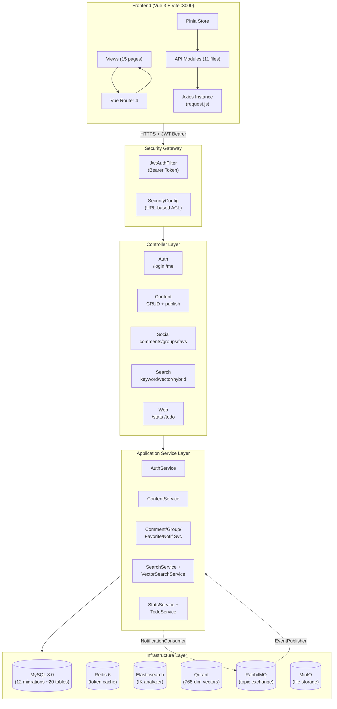

### 2.2 Module Dependency Graph

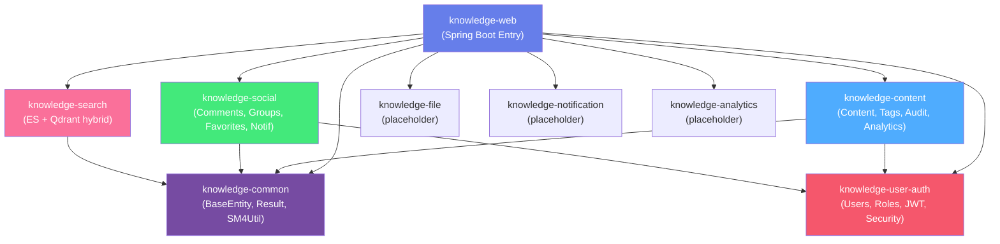

### 2.3 Package Structure (DDD-Lite)

Each module follows a consistent layered architecture:

```
module-name/
├── interfaces/
│   └── controller/     ← @RestController, request/response mapping
├── application/
│   ├── service/        ← @Service, business logic orchestration
│   └── dto/            ← Request/Response DTOs with @Valid annotations
├── domain/
│   ├── model/          ← @Entity, domain objects, enums
│   └── repository/     ← Repository interfaces (domain contracts)
└── infrastructure/
    ├── mapper/         ← MyBatis-Plus @Mapper interfaces
    ├── repository/     ← Repository implementations
    ├── mq/             ← RabbitMQ config, publisher, consumer
    ├── elasticsearch/  ← ES client config + operations
    └── vector/         ← Qdrant client config, embedding service
```

---

## 3. Module Design

### 3.1 knowledge-common — Shared Foundation

**Purpose:** Cross-cutting concerns shared by all modules.

| Component | File | Responsibility |
|-----------|------|---------------|
| `BaseEntity` | `common/base/` | Auto-increment ID + createdAt/updatedAt timestamps |
| `Result<T>` | `common/result/` | Unified API response `{code, message, data}` |
| `PageResult<T>` | `common/result/` | Paginated response with `total`, `page`, `size` |
| `BizException` | `common/exception/` | Domain exceptions with HTTP status mapping |
| `GlobalExceptionHandler` | `common/exception/` | `@ControllerAdvice` for consistent error responses |
| `MyBatisPlusConfig` | `common/config/` | Pagination interceptor + auto-fill timestamps |
| `SM4Util` | `common/util/` | SM4/CBC/PKCS7 encryption/decryption (BouncyCastle) |

### 3.2 knowledge-user-auth — Authentication & Authorization

**Purpose:** User identity, role-based access control, JWT token management.

**Components:**

| Component | Responsibility |
|-----------|---------------|
| `AuthController` | `POST /login`, `GET /me` |
| `UserController` | Admin user management |
| `AuthService` | Login validation, JWT generation, current user lookup |
| `JwtUtil` | HMAC-SHA256 token sign/verify with configurable expiration |
| `JwtAuthFilter` | `OncePerRequestFilter` — extracts Bearer token, sets SecurityContext |
| `SecurityConfig` | URL-based authorization rules, BCrypt, CORS, stateless sessions |

**Security Rules:**
- `GET/POST /api/auth/**` — authenticated
- `/api/admin/**` — `hasRole("ADMIN")`
- All others — authenticated
- `/api/auth/login` — permitAll

### 3.3 knowledge-content — Content Lifecycle

**Purpose:** Core content management — creation, publishing, versioning, auditing.

**Content State Machine:**
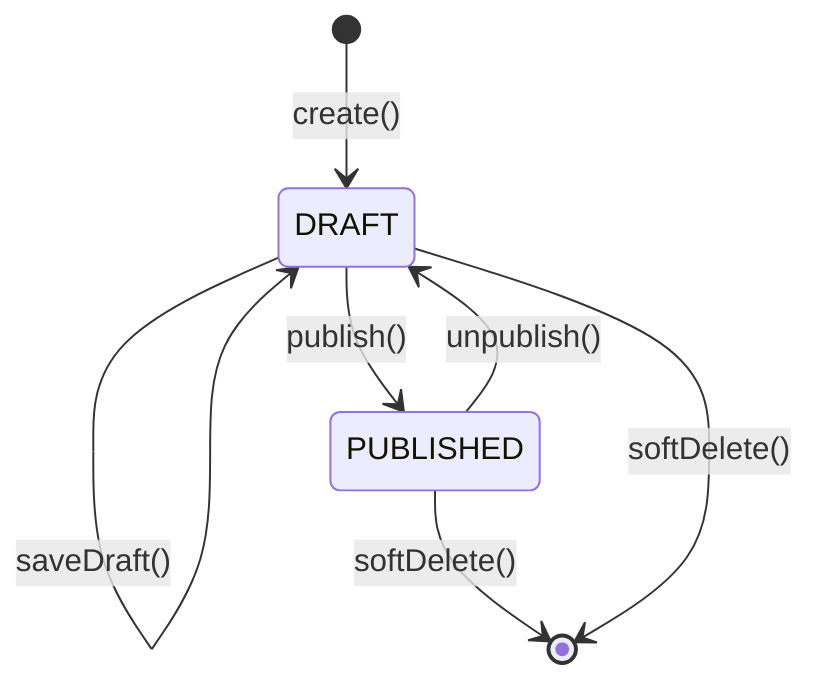

**Sub-domains:**
- **Tags:** Global tag pool with color, content-tag many-to-many
- **Sensitive Words:** Aho-Corasick automaton for real-time text scanning
- **Content Versions:** Snapshot on each save with version number
- **Audit Records:** PENDING → APPROVED/REJECTED workflow
- **Content Templates:** Preset Markdown templates
- **Scheduled Publishing:** Future-dated publish with status tracking
- **Analytics:** User action logging, content stats, search hot keywords

### 3.4 knowledge-social — Community Features

**Purpose:** User interaction — comments, favorites, groups, notifications.

**Comment System:**
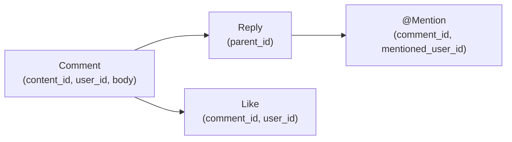

**Notification Flow:**
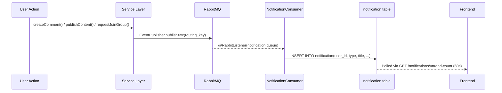

### 3.5 knowledge-search — Hybrid Search

**Purpose:** Full-text + semantic search with result fusion.

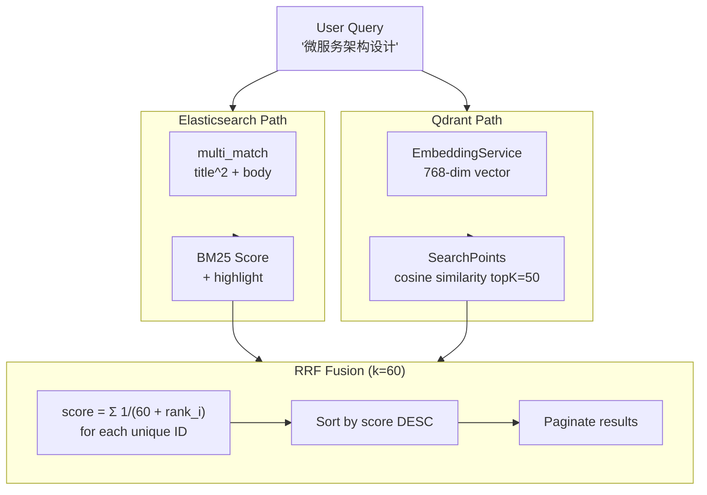

**Index Design:**
- ES mapping: `title` (ik_max_word/ik_smart), `body` (ik_max_word/ik_smart), `contentType` (keyword), `publishedAt` (date)
- Qdrant: 768-dim vectors, cosine distance, payload includes title/body for later retrieval

### 3.6 knowledge-web — Aggregation Module

**Purpose:** Spring Boot entry point, cross-module stats and todo aggregation.

- `StatsController` — Platform-wide aggregate counts (public, auth'd)
- `TodoController` — User-specific pending counts: drafts, approvals, audits, notifications
- `DataGenerator` — Test data generator (500K content, 2M comments, configurable)
- `EncryptedPropertyPostProcessor` — SM4-decrypts `SM4(...)` values at startup

---

## 4. Data Flow Design

### 4.1 Content List Load (Highest Traffic Path)

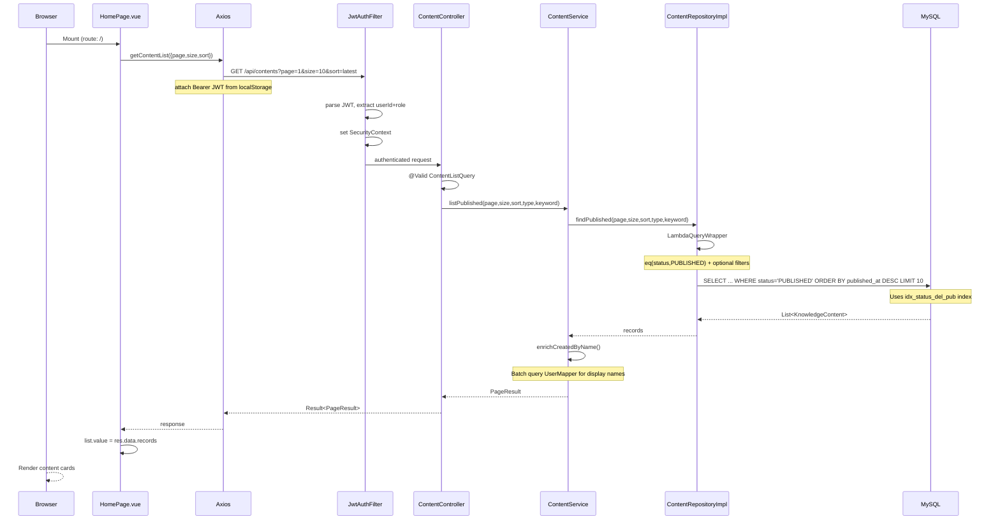

### 4.2 Search Flow

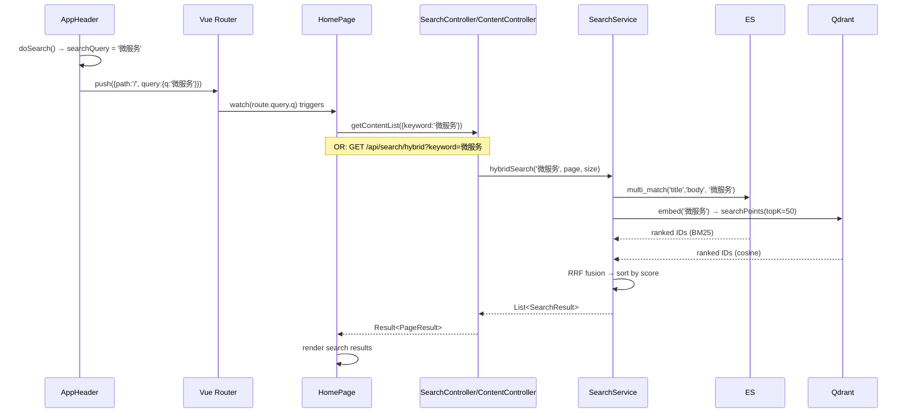

### 4.3 Notification Delivery Flow

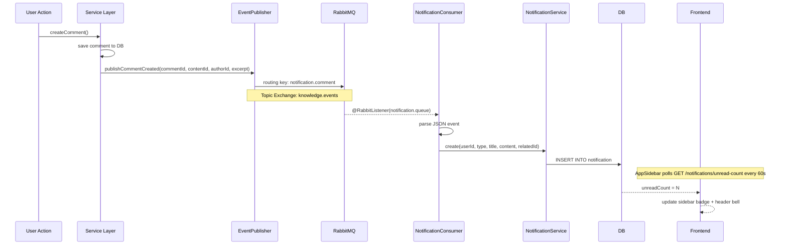

---

## 5. Database Design

### 5.1 Table Inventory (20 tables, 12 Flyway migrations)

| Migration | Tables | Purpose |
|-----------|--------|---------|
| V1 | `user`, `department`, `role`, `permission`, `user_role`, `role_permission` | Auth & identity |
| V2 | `knowledge_content`, `content_group_relation` | Core content |
| V3 | `group_info`, `group_member` | Community groups |
| V4 | `tag`, `content_tag_relation` | Tagging system |
| V5 | `comment`, `comment_like`, `comment_mention` | Discussions |
| V6 | `sensitive_word` | Content moderation |
| V7 | `favorite` | Bookmarks |
| V8 | `notification` | User notifications |
| V9 | `content_version`, `audit_record`, `content_template`, `scheduled_publish` | Content toolchain |
| V10 | `user_action_log`, `content_stats`, `search_hot_keyword` | Analytics |
| V11 | (indexes only) | Query optimization |
| V12 | (indexes only) | COUNT optimization |

### 5.2 Entity Relationship

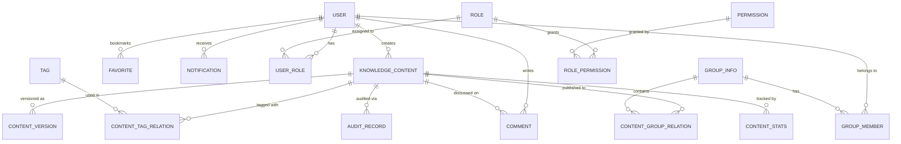

---

## 6. Performance Design

### 6.1 Index Strategy

**knowledge_content (primary query target, 500K+ rows):**

| Index | Columns | Query Pattern | Benefit |
|-------|---------|---------------|---------|
| PRIMARY | (id) | Point lookup by ID | Direct access |
| `idx_created_by` | (created_by) | My drafts, my content | Filter by author |
| `idx_created_at` | (created_at) | Today's content count | Range scan instead of full scan |
| `idx_status_del_pub` | (status, is_deleted, published_at) | Content list + COUNT | Index-only count scan, avoids table access |
| `idx_status_type_pub` | (status, content_type, published_at) | Filtered list by type | Composite filter + sort |

**group_member (50K+ rows):**

| Index | Columns | Query Pattern |
|-------|---------|---------------|
| `uk_group_user` | (group_id, user_id) UNIQUE | Check membership |
| `idx_user_status` | (user_id, status) | My groups |
| `idx_group_status` | (group_id, status) | Pending approvals count |

**group_info:**

| Index | Columns | Query Pattern |
|-------|---------|---------------|
| `idx_owner` | (owner_id) | My owned groups |
| `idx_visibility_status` | (visibility, status) | Public group listing |

**notification:**

| Index | Columns | Query Pattern |
|-------|---------|---------------|
| `idx_user_read` | (user_id, is_read) | Unread count, list |
| `idx_created` | (created_at DESC) | Recent notifications |

### 6.2 Query Optimization Decisions

**Decision 1: Drop `idx_is_deleted`.** This index had cardinality of 2 (0 and 1), with 99%+ of rows having value 0. MySQL's optimizer would never choose it, and its presence could confuse the query planner into using it for the COUNT query. Replaced by `idx_status_del_pub` which includes `is_deleted` as the second column in a high-selectivity composite index.

**Decision 2: Index-only COUNT scan.** The `SELECT COUNT(*) FROM knowledge_content WHERE status='PUBLISHED' AND is_deleted=0` query is executed on every page load (MyBatis-Plus `selectPage` counts first). By placing `is_deleted` in a composite index with `status`, MySQL can count entirely from the index B-tree without touching table rows.

**Decision 3: Composite indexes for common filter + sort patterns.** `(status, content_type, published_at)` covers "list published with type filter, sorted by pub date" — the most common content query. `(visibility, status)` covers the public group listing.

### 6.3 Frontend Caching

| Cache | Location | TTL | Purpose |
|-------|----------|-----|---------|
| Group list | `api/group.js` memory | 3 min | Avoid repeated group list fetches (used in filter dropdowns) |
| Tags list | `api/tag.js` memory | 5 min | Avoid repeated tag fetches (used in tag selector) |

### 6.4 Connection Pool & Timeouts

| Setting | Value | Reason |
|---------|-------|--------|
| Axios timeout | 15s | Prevents hanging requests blocking UI |
| `rewriteBatchedStatements=true` | JDBC URL | Enables MySQL batch INSERT optimization |
| MyBatis-Plus pagination | Physical (not memory) | `selectPage` with count optimization |

---

## 7. Security Design

### 7.1 Authentication Flow

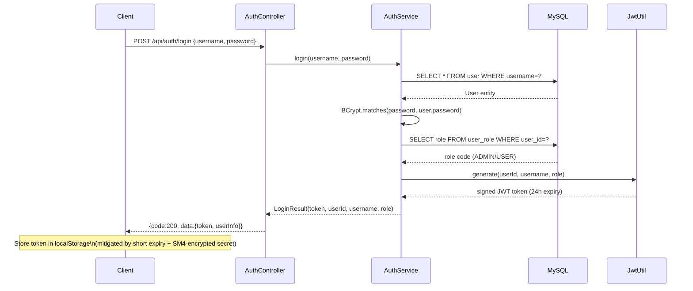

### 7.2 Authorization Layers (Defense in Depth)

```
Layer 1: URL Pattern Matching (SecurityConfig)
  ├── /api/admin/**  → requires ROLE_ADMIN
  ├── /api/auth/login → permitAll
  └── /** → authenticated

Layer 2: Ownership Checks (Service Layer)
  ├── Notification: verify notification.userId == currentUserId
  ├── Content edit: verify content.createdBy == currentUserId
  ├── Comment delete: verify comment.userId == currentUserId
  └── Group manage: verify group.ownerId == currentUserId

Layer 3: Method Parameter Validation (@Valid DTOs)
  ├── ContentType enum validation
  ├── String size limits (@Size, @NotBlank)
  └── Enum value constraints (@Pattern)
```

### 7.3 SM4 Encryption for Configuration Secrets

**Problem:** Sensitive values (DB password, JWT secret, RabbitMQ/MinIO credentials) were hardcoded in `application.yml` and committed to git.

**Solution:** SM4/CBC/PKCS7Padding encryption at rest, automatic decryption at startup.

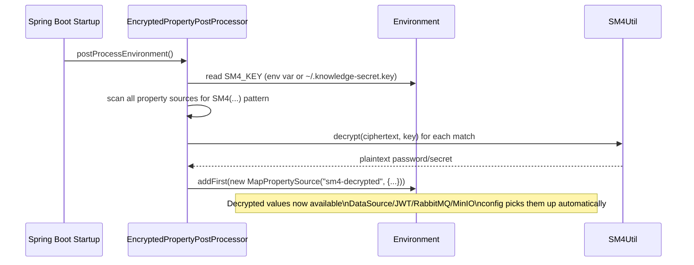

**Key Management:**
- Master key: 128-bit SM4 key (hex-encoded)
- Storage: Single environment variable `SM4_KEY` or file `~/.knowledge-secret.key`
- Rotation: Generate new key via `SM4Util genkey`, re-encrypt all secrets via `SM4Util encrypt <key> <value>`, update application.yml

### 7.4 Vulnerability Mitigations Applied

| Vulnerability | Mitigation | Verification |
|--------------|------------|-------------|
| Hardcoded secrets in git | SM4-encrypted in application.yml, key via env var | All `SM4(...)` values require SM4_KEY to decrypt |
| IDOR on notification endpoints | Ownership check: `notification.userId == auth.getPrincipal()` | `NotificationController` passes `Authentication` to service |
| PII leak via `/auth/me` | Null out `ssoId` and `email` before returning User | `AuthService.getCurrentUser()` clears sensitive fields |
| Unvalidated request bodies | `@Valid` DTOs with `@NotBlank`, `@Size`, `@Pattern` | All controllers use validated DTOs |
| SQL injection | MyBatis-Plus `LambdaQueryWrapper` (parameterized queries) | No string concatenation in any SQL path |
| XSS via Markdown | `DOMPurify.sanitize(marked(raw))` before `v-html` | ContentDetail.vue:106 |
| CSRF on REST API | Disabled (stateless JWT, no cookies) | `SecurityConfig` stateless session policy |
| SQL query data leakage | Removed `StdOutImpl` mybatis logging | production config has no log-impl |
| Path traversal | Axios URL-encodes path params, backend uses path variables | `@PathVariable Long id` type checking |

### 7.5 JWT Token Configuration

| Property | Value | Rationale |
|----------|-------|-----------|
| Algorithm | HMAC-SHA256 | Industry standard, sufficient for internal use |
| Secret | SM4-encrypted, 256+ bits | Strong key, not exposed in plaintext anywhere |
| Expiration | 24 hours (86400000ms) | Balance security vs UX, no refresh token yet |
| Storage | localStorage (frontend) | Acceptable with short expiry + no third-party scripts |
| Transmission | `Authorization: Bearer <token>` header | Standard, immune to CSRF |

### 7.6 Access Control Matrix

| Endpoint Pattern | Anonymous | User | Admin |
|-----------------|-----------|------|-------|
| `POST /api/auth/login` | ✅ | ✅ | ✅ |
| `GET /api/contents/**` | — | ✅ | ✅ |
| `POST /api/contents` | — | ✅ | ✅ |
| `PUT /api/contents/{id}` | — | owner only | ✅ |
| `DELETE /api/contents/{id}` | — | owner only | ✅ |
| `POST /api/groups` | — | ✅ | ✅ |
| `PUT /api/groups/{id}/members/{uid}` | — | owner only | ✅ |
| `GET /api/admin/**` | — | — | ✅ |
| `GET /api/stats/overview` | — | ✅ | ✅ |
| `GET /api/todo/counts` | — | ✅ (own data) | ✅ |
| `GET /api/notifications` | — | own only | own only |
| `PUT /api/notifications/{id}/read` | — | own only | own only |

---

## Appendix A: Frontend Route Map

| Path | Component | Auth Required | Admin Only |
|------|-----------|--------------|------------|
| `/login` | LoginPage | No | No |
| `/` | HomePage (stats + todo + feed) | Yes | No |
| `/content/create` | ContentCreate | Yes | No |
| `/content/:id` | ContentDetail | Yes | No |
| `/content/:id/edit` | ContentEdit | Yes | No |
| `/groups` | GroupList | Yes | No |
| `/group/:id` | GroupDetail | Yes | No |
| `/group/:id/manage` | GroupManage | Yes | owner only |
| `/favorites` | FavoritesPage | Yes | No |
| `/notifications` | NotificationsPage | Yes | No |
| `/templates` | TemplatesPage | Yes | No |
| `/admin/tags` | TagManage | Yes | Yes |
| `/admin/users` | UserManage | Yes | Yes |
| `/admin/sensitive-words` | SensitiveWordManage | Yes | Yes |
| `/admin/analytics` | AnalyticsDashboard | Yes | Yes |
| `/admin/audit` | AuditCenter | Yes | Yes |
| `/admin/departments` | DepartmentManage | Yes | Yes |
| `/admin/settings` | SystemSettings | Yes | Yes |

## Appendix B: API Endpoint Summary

| Module | Endpoints | Public | Auth'd | Admin |
|--------|-----------|--------|--------|-------|
| Auth | 2 | 1 | 1 | 0 |
| User Admin | 3 | 0 | 0 | 3 |
| Content | 9 | 2 | 9 | 0 |
| Tags | 6 | 2 | 0 | 4 |
| Comments | 6 | 0 | 6 | 0 |
| Favorites | 4 | 0 | 4 | 0 |
| Groups | 8 | 0 | 8 | 0 |
| Notifications | 5 | 0 | 5 | 0 |
| Search | 3 | 0 | 3 | 0 |
| Sensitive Words | 5 | 0 | 0 | 5 |
| Analytics | 4 | 0 | 0 | 4 |
| Toolchain | 12 | 0 | 6 | 6 |
| Web (Stats/Todo) | 2 | 0 | 2 | 0 |
| **Total** | **69** | **5** | **46** | **18** |
