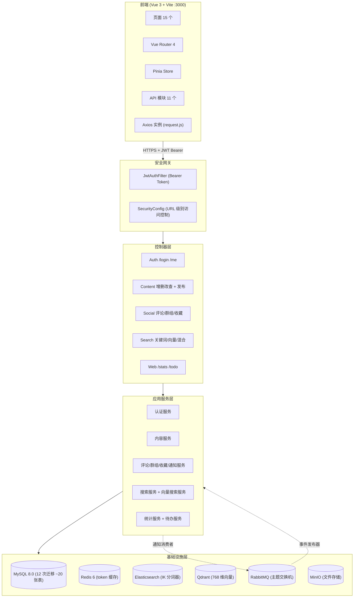
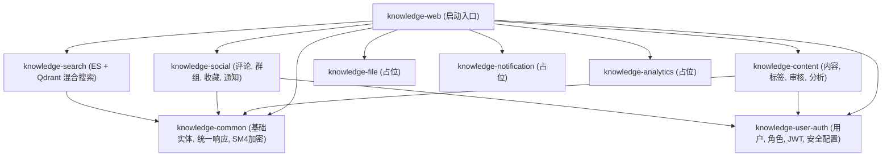
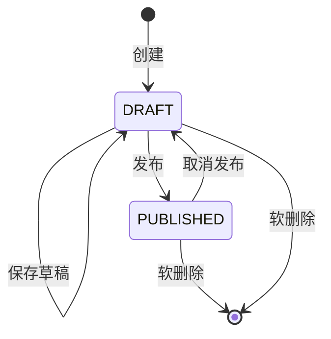
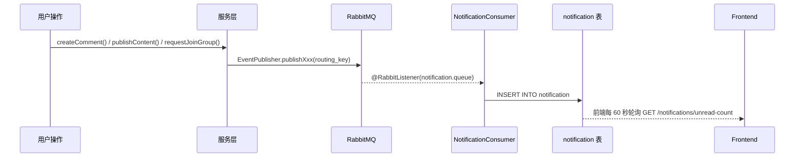
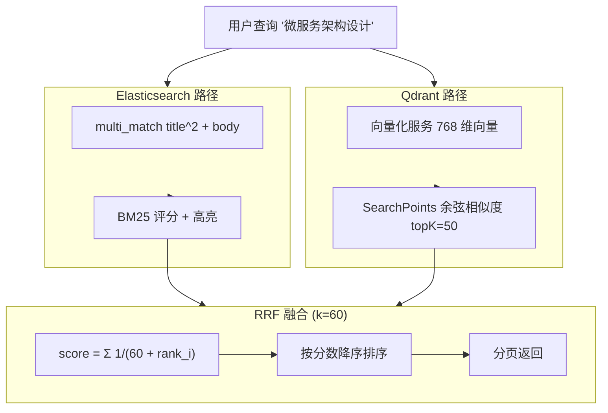
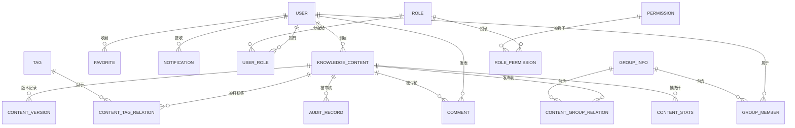

# Knowledge Share 知识共享平台 — 完整设计文档

> **版本:** 2026-05-28 | **状态:** 已实施  
> **合并来源:** `architecture-and-design.md` + `2026-04-25-knowledge-platform-design.md` + `unit-test-plan.md` + `sm4-data-encryption-plan.md` + `sm4-encryption-decision-record.md`

---

## 目录

1. [项目概述](#1-项目概述)
2. [系统架构](#2-系统架构)
3. [数据模型](#3-数据模型)
4. [功能模块详细设计](#4-功能模块详细设计)
5. [数据库设计](#5-数据库设计)
6. [API 设计概要](#6-api-设计概要)
7. [安全设计](#7-安全设计)
8. [性能设计](#8-性能设计)
9. [AI 技术应用方案](#9-ai-技术应用方案)
10. [测试方案](#10-测试方案)
11. [部署架构](#11-部署架构)
12. [经验总结](#12-经验总结)
13. [附录](#13-附录)

---

## 1. 项目概述

### 1.1 项目定义

Knowledge Share 是一个企业知识管理平台，支持内容创作、协作、搜索和治理。用户可以创建按群组和标签组织的 Markdown 内容，平台提供全文+向量混合搜索、评论讨论、收藏、通知以及管理员控制的审核工作流。

### 1.2 核心功能范围

- **内容发布**：支持 Markdown、PPT（在线预览/下载）、外部链接、内部引用
- **群组管理**：公开群组、申请审批、内容分发
- **全文检索 + 语义搜索**：关键词匹配 + AI 向量相似度检索
- **用户权限**：SSO/账号登录、组织架构集成、角色权限体系（全局角色 + 群组内角色）
- **标签体系**：管理员统一管理全局标签 + 单内容多标签 + 标签搜索
- **收藏功能**：收藏/取消收藏 + 收藏列表 + 跳转阅读
- **消息通知系统**：站内通知 + 多场景触发 + 通知管理
- **评论与互动**：评论发布/回复 + 点赞 + 举报 + 审核 + 敏感词过滤 + @提及
- **内容工具链**：历史版本管理 + 审核工作流 + 内容模板 + 定时发布
- **数据分析**：内容趋势 + 热门排行 + 搜索热词 + 群组活跃度

### 1.3 非功能范围

- 移动端：不纳入
- 邮件/短信/IM推送：不纳入
- 多人协同编辑：不纳入
- 知识图谱：不纳入

### 1.4 技术栈

| 层次 | 技术 | 版本 |
|------|------|------|
| 前端 | Vue 3 (Composition API) + Vite + Element Plus + Pinia | Vite 8, Vue 3.5 |
| 后端 | Spring Boot + MyBatis-Plus | Boot 3.2.0, MP 3.5.5 |
| 认证 | JWT (jjwt HMAC-SHA256) | 0.11.5 |
| 数据库 | MySQL | 8.0 |
| 缓存 | Redis | 6.x |
| 全文搜索 | Elasticsearch + IK 中文分词器 | 8.11.0 |
| 向量搜索 | Qdrant (gRPC, 余弦相似度, 768维) | 1.9.1 |
| AI Embedding | BGE-base-zh（768维向量） | 开源中文模型 |
| 消息队列 | RabbitMQ (Topic Exchange) | 3.x |
| 对象存储 | MinIO | latest |
| 加密 | SM4 (国密) CBC/PKCS7 via BouncyCastle | 1.78 |

---

## 2. 系统架构

### 2.1 系统架构总览



### 2.2 DDD 模块化单体架构

#### 2.2.1 Maven 模块拆分（9 个模块）

```
knowledge-platform/
├── knowledge-common/          # 公共基础设施（DTO、工具类、异常定义、SM4加密）
├── knowledge-user-auth/       # 用户 + 部门 + 角色权限
├── knowledge-content/         # 内容发布 + 版本管理 + 审核工作流 + 标签
├── knowledge-social/          # 评论 + 群组 + 收藏 + 通知
├── knowledge-search/          # 搜索（ES/Qdrant 集成）
├── knowledge-web/             # Spring Boot 启动入口 + 聚合层
├── knowledge-file/            # 文件服务（占位模块）
├── knowledge-notification/    # 通知（占位模块）
└── knowledge-analytics/       # 数据分析（占位模块）
```

#### 2.2.2 模块依赖关系



#### 2.2.3 包结构（DDD 精简版分层）

```
模块名/
├── interfaces/
│   └── controller/     ← @RestController, 请求/响应映射
├── application/
│   ├── service/        ← @Service, 业务逻辑编排
│   └── dto/            ← 请求/响应 DTO (带 @Valid 校验注解)
├── domain/
│   ├── model/          ← 实体, 领域对象, 枚举
│   └── repository/     ← 仓储接口 (领域契约)
└── infrastructure/
    ├── mapper/         ← MyBatis-Plus @Mapper 接口
    ├── repository/     ← 仓储实现类
    ├── mq/             ← RabbitMQ 配置, 事件发布器, 消费者
    ├── elasticsearch/  ← ES 客户端配置和操作
    └── vector/         ← Qdrant 客户端配置, 向量化服务
```

#### 2.2.4 模块间通信规则

| 通信方式 | 适用场景 |
|---------|---------|
| **直接依赖调用** | 查询类操作（如查标签名称）、同步校验（如校验群组存在） |
| **领域事件（MQ）** | 异步通知（发布→群成员）、索引更新（内容变更→ES/Qdrant 重建）、数据采集（浏览→埋点） |

### 2.3 消息队列事件设计

#### Topic 规划

| Topic | 生产者 | 消费者 | 说明 |
|-------|--------|--------|------|
| `content.event` | content | notification, search, analytics | 内容发布/更新/删除 |
| `comment.event` | social | notification, analytics | 评论发布/回复/@提及 |
| `group.event` | social | notification, analytics | 入群申请/审批/群组创建 |
| `audit.event` | content | notification | 审核通过/驳回 |
| `user.action` | web（埋点） | analytics | 浏览/搜索/收藏行为 |
| `file.process` | content | file | PPT 解析、图片压缩等异步处理 |

#### 消息可靠性策略

| 策略 | 说明 |
|------|------|
| **生产者确认** | 发送消息后等待 Broker ACK，失败重试 3 次 |
| **消费者手动 ACK** | 业务处理成功后再确认，失败进入死信队列 |
| **幂等消费** | 消费者通过 eventId 去重，防止重复处理 |
| **本地消息表** | 关键业务先写本地事件表，再发 MQ，定时任务补偿 |

---

## 3. 数据模型

### 3.1 用户权限模块

- `User`：用户基本信息、SSO标识、所属部门
- `Department`：部门树形结构
- `Role`：角色定义（系统管理员、普通用户）
- `Permission`：权限点
- `GroupMember`：群组成员（用户、群组、角色、入群时间、审批状态）

**关系**：用户 N:1 部门 | 用户 N:N 全局角色 | 用户 1:N GroupMember | 角色 N:N 权限

**全局角色权限矩阵：**

| 权限项 | 普通用户 | 系统管理员 |
|--------|---------|-----------|
| 查看公开内容 | ✅ | ✅ |
| 搜索内容 | ✅ | ✅ |
| 发表评论 | ✅ | ✅ |
| 申请创建群组 | ✅ | ❌ |
| 审批群组创建 | ❌ | ✅ |
| 申请加入群组 | ✅ | ✅ |
| 管理标签 | ❌ | ✅ |
| 管理用户/部门 | ❌ | ✅ |
| 管理敏感词 | ❌ | ✅ |
| 审核内容/评论 | ❌ | ✅ |
| 查看数据看板 | ❌ | ✅ |

**群组内角色权限：**

| 权限项 | 群主 | 成员 |
|--------|------|------|
| 查看群组内容 | ✅ | ✅ |
| 在群组内分享内容 | ✅ | ✅ |
| 审批加入申请 | ✅ | ❌ |
| 管理群组成员 | ✅ | ❌ |
| 管理群组内内容 | ✅ | ❌ |

### 3.2 内容发布模块

- `KnowledgeContent`：知识内容（标题、正文、类型、状态、创建者、时间）
- `ContentGroupRelation`：内容-群组多对多关联
- `ContentTag`：内容标签

**内容类型**：`MARKDOWN` / `PPT_FILE` / `EXTERNAL_URL` / `INTERNAL_REF`  
**发布状态**：`DRAFT` / `PUBLISHED`

**内容状态机：**



### 3.3 群组管理模块

- `Group`：群组（名称、描述、创建者、可见性、创建时间）
- `GroupMember`：群组成员

**可见性**：`PUBLIC`（全员可见）/ `PARTIAL`（群主控制）  
**审批状态**：`PENDING` / `APPROVED` / `REJECTED`

### 3.4 标签体系模块

- `Tag`：标签（名称、颜色、创建人）
- `ContentTagRelation`：内容-标签关联

标签由管理员统一管理，支持多标签打标。

### 3.5 收藏模块

- `Favorite`：收藏（用户ID + 内容ID，联合唯一索引防重复）

### 3.6 消息通知模块

- `Notification`：通知（用户ID、类型、标题、内容、关联实体、已读状态）

**通知类型**：`CONTENT_PUBLISHED` / `COMMENT_REPLY` / `COMMENT_MENTION` / `GROUP_JOIN_APPROVED` / `GROUP_JOIN_REJECTED` / `GROUP_JOIN_APPLY` / `GROUP_CREATE_APPROVED` / `GROUP_CREATE_REJECTED` / `GROUP_CREATE_APPLY` / `CONTENT_UPDATED` / `CONTENT_AUDIT_APPROVED` / `CONTENT_AUDIT_REJECTED` / `SYSTEM_ANNOUNCEMENT`

### 3.7 评论互动模块

- `Comment`：评论（内容ID、父评论ID、回复信息、正文、点赞数、状态、审核状态）
- `CommentLike`：点赞（commentId + userId 唯一索引）
- `CommentMention`：@提及（commentId + mentionedUserId）
- `SensitiveWord`：敏感词（word 唯一索引）

### 3.8 内容生产工具链模块

- `ContentVersion`：历史版本（contentId + versionNumber 唯一）
- `AuditRecord`：审核记录（目标类型+ID、提交人、审核人、状态、原因）
- `ContentTemplate`：内容模板
- `ScheduledPublish`：定时发布

### 3.9 数据分析模块

- `UserActionLog`：用户行为日志（行为类型、目标、扩展字段 JSON）
- `ContentStats`：内容统计快照（contentId + statDate 唯一）
- `SearchHotKeyword`：搜索热词（keyword + statDate 唯一）

---

## 4. 功能模块详细设计

### 4.1 knowledge-common — 公共基础

| 组件 | 职责 |
|------|------|
| `BaseEntity` | 自增 ID + 创建/更新时间戳自动填充 |
| `Result<T>` | 统一 API 响应 `{code, message, data}` |
| `PageResult<T>` | 分页响应，含 `total`, `page`, `size` |
| `BizException` | 领域异常，映射 HTTP 状态码 |
| `GlobalExceptionHandler` | `@ControllerAdvice` 统一异常处理 |
| `MyBatisPlusConfig` | 分页拦截器 + 时间戳自动填充 |
| `SM4Util` | SM4/CBC/PKCS7 加密解密 (BouncyCastle) |

### 4.2 knowledge-user-auth — 认证与授权

- `AuthController`：`POST /login` 登录、`GET /me` 获取当前用户
- `UserController`：管理员用户管理
- `AuthService`：登录校验、JWT 生成、当前用户查询
- `JwtUtil`：HMAC-SHA256 令牌签名/验证，24h 可配置过期
- `JwtAuthFilter`：`OncePerRequestFilter`，提取 Bearer 令牌设置 SecurityContext
- `SecurityConfig`：URL 级别授权规则、BCrypt 加密、CORS 配置、无状态会话

**安全规则**：`/api/auth/login` 允许匿名，`/api/admin/**` 需要 ADMIN 角色，其余需认证。

### 4.3 knowledge-content — 内容生命周期

**子领域：**
- **标签管理**：全局标签池（含颜色），内容-标签多对多关联
- **敏感词检测**：Aho-Corasick 自动机实现实时文本扫描
- **内容版本**：每次保存生成快照并分配版本号
- **审核记录**：PENDING → APPROVED/REJECTED 工作流
- **内容模板**：预置 Markdown 模板
- **定时发布**：未来时间发布，带状态追踪
- **数据分析**：用户行为日志、内容统计、搜索热词

**发布流程**：创建草稿 → 编辑内容 + 选择标签 → 选择群组（至少1个）→ 设置可见性 → 发布（生成向量数据 + 通知群组成员）

**删除级联**：软删除后同步清理向量数据、收藏记录、关联文件。

### 4.4 knowledge-social — 社区功能

**评论系统**：一级评论 + 二级回复（不嵌套更深），支持点赞（commentId+userId 唯一）、@提及（自动通知）、举报。

**群组管理**：
- 创建：普通用户申请 → 管理员审批 → 申请人成为群主
- 加入：用户申请 → 群主审批 → 成为成员
- 解散：群主/管理员解散，软删除群组

**通知事件流**：



### 4.5 knowledge-search — 混合搜索

全文检索 + 语义搜索 + RRF 结果融合：



**索引设计：**
- ES：`title`（ik_max_word/ik_smart）、`body`（ik_max_word/ik_smart）、`contentType`（keyword）、`publishedAt`（date）
- Qdrant：768 维向量，余弦距离

### 4.6 knowledge-web — 聚合模块

Spring Boot 启动入口，跨模块数据聚合：
- `StatsController` — 平台级聚合统计
- `TodoController` — 用户专属待办计数（草稿、审批、审核、通知）
- `DataGenerator` — 测试数据生成器（50万内容、200万评论）
- `EncryptedPropertyPostProcessor` — 启动时自动解密 `SM4(...)` 加密的配置值

---

## 5. 数据库设计

### 5.1 表清单（20 张表，12 次 Flyway 迁移）

| 迁移 | 表 | 用途 |
|------|----|------|
| V1 | `user`, `department`, `role`, `permission`, `user_role`, `role_permission` | 认证与身份 |
| V2 | `knowledge_content`, `content_group_relation` | 核心内容 |
| V3 | `group_info`, `group_member` | 社区群组 |
| V4 | `tag`, `content_tag_relation` | 标签系统 |
| V5 | `comment`, `comment_like`, `comment_mention` | 评论讨论 |
| V6 | `sensitive_word` | 内容审核 |
| V7 | `favorite` | 收藏 |
| V8 | `notification` | 用户通知 |
| V9 | `content_version`, `audit_record`, `content_template`, `scheduled_publish` | 内容工具链 |
| V10 | `user_action_log`, `content_stats`, `search_hot_keyword` | 数据分析 |
| V11-V12 | 索引变更 | 查询优化 |
| V13 | DDL 变更 | SM4 加密字段长度扩展 |

### 5.2 实体关系图



---

## 6. API 设计概要

| 模块 | 接口数 | 公开 | 需认证 | 仅管理员 | 主要端点 |
|------|--------|------|--------|---------|----------|
| 认证 | 2 | 1 | 1 | 0 | `POST /api/auth/login`, `GET /api/auth/me` |
| 内容 | 9 | 2 | 9 | 0 | CRUD `/api/contents` + publish/draft |
| 标签 | 6 | 2 | 0 | 4 | CRUD `/api/tags` |
| 评论 | 6 | 0 | 6 | 0 | CRUD + like/report `/api/comments` |
| 收藏 | 4 | 0 | 4 | 0 | CRUD `/api/favorites` |
| 群组 | 8 | 0 | 8 | 0 | CRUD + join/members `/api/groups` |
| 通知 | 5 | 0 | 5 | 0 | 列表 + 未读数 + 已读 `/api/notifications` |
| 搜索 | 3 | 0 | 3 | 0 | 混合搜索 + 建议 `/api/search` |
| 敏感词 | 5 | 0 | 0 | 5 | CRUD + 批量导入 `/api/sensitive-words` |
| 数据分析 | 4 | 0 | 0 | 4 | 总览/趋势/热门/热词 `/api/analytics` |
| 内容工具链 | 12 | 0 | 6 | 6 | 版本/审核/模板/定时发布 |
| 聚合模块 | 2 | 0 | 2 | 0 | `/api/stats/overview`, `/api/todo/counts` |
| **合计** | **69** | **5** | **46** | **18** | |

---

## 7. 安全设计

### 7.1 认证与授权（纵深防御三层）

```
第一层: URL 模式匹配 (SecurityConfig)
  ├── /api/auth/login → 允许匿名访问
  ├── /api/admin/** → 需要 ROLE_ADMIN
  └── /** → 需要认证

第二层: 数据所有权校验 (Service 层)
  ├── 通知: notification.userId == currentUserId
  ├── 内容编辑: content.createdBy == currentUserId
  ├── 评论删除: comment.userId == currentUserId
  └── 群组管理: group.ownerId == currentUserId

第三层: 方法参数校验 (@Valid DTOs)
  ├── 内容类型枚举校验
  ├── 字符串长度限制 (@Size, @NotBlank)
  └── 枚举值约束 (@Pattern)
```

### 7.2 JWT 令牌配置

| 属性 | 值 | 设计理由 |
|------|----|----------|
| 签名算法 | HMAC-SHA256 | 行业标准 |
| 签名密钥 | SM4 加密存储，256+ 位 | 明文不暴露 |
| 过期时间 | 24 小时 | 安全性与体验平衡 |
| 前端存储 | localStorage | 短有效期 + 无第三方脚本 |
| 传输方式 | `Authorization: Bearer <token>` | 标准做法，天然免疫 CSRF |

### 7.3 SM4 国密加密方案

> 本节合并自 `sm4-data-encryption-plan.md` 和 `sm4-encryption-decision-record.md`

#### 7.3.1 背景

项目对安全性要求高，需对数据库中存储的个人信息字段进行 SM4 加密存储。经审查全部 25 张表、26 个实体类，在 `user` 表中发现 3 个需加密字段：

| 优先级 | 字段 | 类型 | 原因 | WHERE 条件 |
|--------|------|------|------|-----------|
| 高 | `email` | VARCHAR(128→256) | 个人信息 | 否 |
| 高 | `username` | VARCHAR(64→256) | 可能含个人信息 | **是**（登录查找、去重） |
| 中 | `display_name` | VARCHAR(64→256) | 可能为真实姓名 | 否 |

#### 7.3.2 两级密钥体系

```
SM4_KEY (环境变量)           ← 启动引导密钥
  ↓ 解密
sm4.data-key (YAML 配置)     ← 数据加密密钥
  ↓ 用于
数据库字段 SM4 加解密
```

| 密钥 | 存储位置 | 用途 |
|------|---------|------|
| `SM4_KEY` | 环境变量 / `~/.knowledge-secret.key` | 解密 YAML 中的 `SM4(...)` 占位符 |
| `sm4.data-key` | `application.yml`（SM4 密文或明文） | 加解密数据库字段 |

#### 7.3.3 加密策略：确定性 vs 随机 IV

决策过程：初版方案考虑 username 使用 ECB 模式保证确定性，但 ECB 存在模式泄露风险且已被业界弃用。最终采用 **SHA-256 派生 IV** 方案。

| 字段 | 加密模式 | IV 策略 | 原因 |
|------|---------|---------|------|
| `username` | 确定性加密 | IV = SHA-256(plaintext)[0:16] | UNIQUE 索引 + WHERE eq 查询 |
| `email` | 确定性加密 | IV = SHA-256(plaintext)[0:16] | 预留查询需求 |
| `displayName` | 随机 IV | SecureRandom 生成 | 仅展示，不做查询条件 |

**确定性加密优势**：同明文→同 IV→同密文，UNIQUE 索引和精确匹配依然有效；不同明文→不同 IV（由自身值派生），无全局固定 IV 的模式泄露风险。

#### 7.3.4 核心组件

```
SM4Util
  ├── encrypt(plaintext, key)        → 随机 IV 加密
  ├── decrypt(ciphertext, key)       → 解密
  ├── encryptDeterministic(text, key) → IV = SHA-256(text)[0:16]
  └── decryptDeterministic(text, key) → 同 decrypt

Sm4Config (@Configuration)
  └── @Value("${sm4.data-key}") → static key holder

SM4DeterministicTypeHandler extends BaseTypeHandler<String>
  ├── setNonNullParameter → encryptDeterministic()
  └── getNullableResult   → decryptDeterministic()

SM4EncryptTypeHandler extends BaseTypeHandler<String>
  ├── setNonNullParameter → encrypt()
  └── getNullableResult   → decrypt()

DataEncryptInitializer implements ApplicationRunner
  └── 启动时检测并加密存量明文数据（JdbcTemplate 绕过 TypeHandler）
```

#### 7.3.5 架构总览

```
┌─────────────────────────────────────────────────────┐
│                   application.yml                    │
│  sm4.data-key: SM4(...)  ← EncryptedPropertyPP 解密  │
└───────────────────────┬─────────────────────────────┘
                        ↓
┌─────────────────────────────────────────────────────┐
│                    Sm4Config                         │
│  @Value("${sm4.data-key}") → static key holder       │
└───────────────────────┬─────────────────────────────┘
                        ↓
┌───────────────────────────────────────────────────────┐
│                   TypeHandler Layer                    │
│  SM4DeterministicTypeHandler  SM4EncryptTypeHandler    │
│  (IV=SHA-256派生，确定性)      (IV=SecureRandom，随机) │
│  用于 username / email         用于 displayName        │
└───────────────────────┬───────────────────────────────┘
                        ↓
┌───────────────────────────────────────────────────────┐
│                    SM4Util                             │
│  SM4/CBC/PKCS7Padding + BouncyCastle                   │
└───────────────────────┬───────────────────────────────┘
                        ↓
┌───────────────────────────────────────────────────────┐
│                    MySQL (user 表)                      │
│  username VARCHAR(256) ← Base64(IV + SM4密文)          │
│  email VARCHAR(256)    ← Base64(IV + SM4密文)          │
│  display_name VARCHAR(256) ← Base64(IV + SM4密文)       │
└───────────────────────────────────────────────────────┘
                        ↑
┌───────────────────────────────────────────────────────┐
│              DataEncryptInitializer                    │
│  ApplicationRunner — 启动时迁移明文存量数据             │
│  JdbcTemplate 直连（绕过 TypeHandler）                  │
└───────────────────────────────────────────────────────┘
```

#### 7.3.6 影响范围

| 模块 | 改动 |
|------|------|
| `knowledge-common` | 新增 TypeHandler × 2、Sm4Config、SM4Util 扩展 |
| `knowledge-web` | `application.yml` 加 `sm4.data-key` |
| `knowledge-user-auth` | `User.java` 加注解、`AuthService.java` 改查询、Flyway V13、`DataEncryptInitializer` |
| `knowledge-content` | **无需修改**（TypeHandler 自动解密） |
| `knowledge-social` | **无需修改**（同上） |

### 7.4 已修复的漏洞

| 漏洞 | 修复措施 |
|------|----------|
| git 中硬编码密钥 | SM4 加密存于 application.yml，密钥通过环境变量传入 |
| 通知接口 IDOR 漏洞 | 所有权校验: `notification.userId == auth.getPrincipal()` |
| `/auth/me` 泄露 SSO ID 和邮箱 | 返回前清空 `ssoId` 和 `email` |
| SQL 注入 | MyBatis-Plus `LambdaQueryWrapper`（参数化查询） |
| Markdown XSS 攻击 | `DOMPurify.sanitize(marked(raw))` 在 `v-html` 前执行 |
| REST API CSRF 攻击 | 禁用 Cookie，使用无状态 JWT |
| 路径遍历攻击 | Axios 编码路径参数，后端类型化 `@PathVariable` |

---

## 8. 性能设计

### 8.1 索引策略

**knowledge_content（50万+ 行核心表）：**

| 索引名 | 列 | 查询场景 | 优化效果 |
|--------|----|----------|----------|
| `idx_created_by` | (created_by) | 我的草稿、我的内容 | 按作者过滤 |
| `idx_created_at` | (created_at) | 今日内容统计 | 范围扫描替代全表扫描 |
| `idx_status_del_pub` | (status, is_deleted, published_at) | 内容列表 + COUNT | **纯索引扫描计数，无需回表** |
| `idx_status_type_pub` | (status, content_type, published_at) | 带类型筛选的列表 | 复合过滤 + 排序 |

**其他关键索引：** `group_member.uk_group_user`（检查群成员）、`notification.idx_user_read`（未读计数）、`group_info.idx_visibility_status`（公开群组列表）。

### 8.2 查询优化决策

- **删除 `idx_is_deleted`**：基数仅 2（0/1），优化器永不选用，由 `idx_status_del_pub` 替代
- **纯索引 COUNT 扫描**：`SELECT COUNT(*)` 在包含 `is_deleted` 和 `status` 的复合索引 B-tree 内完成，避免 45 万次回表
- **复合索引覆盖高频查询**：`(status, content_type, published_at)` 覆盖按类型+排序的最高频模式

### 8.3 其他优化

| 配置项 | 值 | 原因 |
|--------|----|------|
| Axios 超时 | 15s | 防止挂起的请求阻塞 UI |
| `rewriteBatchedStatements=true` | JDBC URL | 启用 MySQL 批量 INSERT 优化 |
| 前端群组列表缓存 | 3 分钟 | 避免重复请求群组下拉 |
| 前端标签列表缓存 | 5 分钟 | 避免重复请求标签选择器 |

---

## 9. AI 技术应用方案

### 9.1 语义搜索（向量检索）

#### 模型选型

| 项目 | 方案 |
|------|------|
| **模型** | BGE-base-zh（768维向量） |
| **模型特点** | 中文优化、支持私有部署、无需调用大模型 API |
| **生成时机** | 内容发布时同步生成 |
| **生成内容** | 标题 + 正文 |
| **冷启动处理** | 纯关键词兜底（新内容暂时无双向量时用关键词匹配） |

#### 向量存储（Qdrant）

| 项目 | 配置 |
|------|------|
| 向量维度 | 768维 |
| TopK | 50 |
| 相似度阈值 | 不设限（返回所有 TopK 结果） |
| 内容更新/删除 | 删除旧向量，更新时下次搜索触发重建 |

#### 混合检索（RRF 融合）

```
用户查询
    │
    ├──→ 关键词检索（ES BM25）──→ 排名列表 A
    │
    └──→ 向量检索（Qdrant）───→ 排名列表 B
              │
              ▼
        RRF 融合公式
        RRF_score = Σ 1/(k + rank_i)   (k=60)
              │
              ▼
        综合排名结果（按分数降序）
```

RRF（Reciprocal Rank Fusion）是业界成熟的混合检索融合算法。关键词检索保证精确匹配，向量检索保证语义理解，两者互补。

#### 性能指标

| 指标 | 要求 |
|------|------|
| 向量生成 | 单条 ≤ 500ms |
| 向量检索响应 | ≤ 1.5秒 |
| 混合检索总响应 | ≤ 3秒 |

#### 批量重建机制

- 触发方式：管理后台手动触发
- 使用场景：模型升级、内容向量损坏/丢失
- 处理方式：分批重建，避免一次性压力

### 9.2 AI 驱动的开发实践

本项目的全流程开发采用 **Claude Code + Superpowers Skills** 体系完成，AI 参与覆盖软件工程全生命周期：

```
需求分析 → 头脑风暴 → 设计文档 → 实现计划 → 编码 → 测试 → 审查 → 安全审查 → 上线
    │         │          │          │        │      │       │         │        │
    ▼         ▼          ▼          ▼        ▼      ▼       ▼         ▼        ▼
 brainstorming  design   writing-plans  subagent  TDD   code    security   qa
              -review              -driven   skill  review   review    skill
```

#### Skills 技能矩阵

| 类别 | Skill | 用途 |
|------|-------|------|
| 流程管控 | brainstorming | 需求澄清、方案探索 |
| | writing-plans | 精确实现计划（每步 2-5 分钟） |
| | subagent-driven-development | 并行多任务开发 |
| 质量保障 | test-driven-development | 先写测试→再写代码 |
| | code-review | 5 角度并行审查 |
| | security-review | 安全漏洞扫描 |
| 辅助工具 | wireframe-prototyping | UI 原型设计 |
| | frontend-design | 前端组件生成 |
| | gstack | 任务编排与调度 |

#### AI 协作最佳实践

| 什么时候用 AI | 什么时候不用 AI |
|-------------|----------------|
| 需求澄清、头脑风暴 | 架构决策（需人工审核） |
| 方案设计、设计文档 | 业务规则变更 |
| 代码生成、模板代码 | 生产环境调试 |
| 测试编写、单元测试 | |
| 代码审查、安全审查 | |

**Skill 选择策略**：简单任务直接执行 / 复杂任务 brainstorming → writing-plans → subagent。

### 9.3 关键技术决策：确定性加密 IV 策略

在 SM4 加密方案中，需解决 "username 字段 UNIQUE 索引与加密确定性" 的矛盾：

```
初版: username 使用随机 IV → 同明文不同密文 → UNIQUE 约束失效
    ↓ 用户反馈：ECB 模式不可用
终版: IV = SHA-256(plaintext)[0:16]
    → 同明文→同 IV→同密文，UNIQUE 约束有效
    → 不同明文→不同 IV（由自身值派生），无模式泄露风险
```

这是 AI 辅助方案设计中 "人机协作" 的典型案例——AI 根据用户的技术约束（拒绝 ECB）快速提出替代方案。

---

## 10. 测试方案

### 10.1 目标

- 覆盖率 ≥ 80%
- 通过率 100%
- 使用 JUnit 5 + Mockito 进行单元测试
- 使用 H2 内存数据库进行集成测试

### 10.2 测试统计

| 模块 | 说明 | 测试数 | 状态 |
|------|------|--------|------|
| knowledge-common | 通用工具/异常/结果类 | 33 | ✅ 全部通过 |
| knowledge-user-auth | 用户认证授权 | 31 | ✅ 全部通过 |
| knowledge-content | 内容管理 | 77 | ✅ 全部通过 |
| knowledge-social | 社交互动 | 40 | ✅ 全部通过 |
| knowledge-search | 搜索服务 | 14 | ✅ 全部通过 |
| knowledge-web | Web 聚合层 | 8 | ✅ 全部通过 |
| knowledge-* (占位) | 文件/通知/分析 | 0 | 无 Java 源码 |

**总计: 203 个测试，0 失败，0 错误，通过率 100%**

### 10.3 测试文件覆盖

**knowledge-common（33 tests）：** BizExceptionTest、GlobalExceptionHandlerTest、SM4UtilTest、MyBatisPlusConfigTest、PageResultTest、ResultTest

**knowledge-user-auth（31 tests）：** AuthServiceTest、AuthServiceExtendedTest、UserControllerTest、AuthControllerTest、UserMapperTest、JwtUtilTest、JwtAuthFilterTest

**knowledge-content（77 tests）：** ContentServiceTest、ProductionToolchainServiceTest、AnalyticsServiceTest、TagServiceTest、SensitiveWordServiceTest、AhoCorasickAutomatonTest、ContentRepositoryTest、TagRepositoryTest、ContentControllerTest

**knowledge-social（40 tests）：** CommentServiceTest、FavoriteServiceTest、GroupServiceTest、NotificationServiceTest、GroupRepositoryTest

**knowledge-search（14 tests）：** SearchServiceTest、VectorSearchServiceTest、SearchControllerTest

**knowledge-web（8 tests）：** StatsServiceTest、TodoServiceTest、StatsControllerTest、TodoControllerTest

### 10.4 测试策略

**单元测试（Mockito）：**
- Service 层：使用 `@Mock` 模拟依赖，`@InjectMocks` 注入被测对象
- Controller 层：使用 standalone `MockMvc` + `GlobalExceptionHandler`
- 工具类：直接实例化测试

**集成测试（H2 内存数据库）：**
- Repository 层：`@SpringBootTest` + H2
- Mapper 层：`@SpringBootTest` + H2 + `schema.sql` 初始化

**关键技术决策：**
1. **跨模块依赖处理**：依赖其他模块 Mapper 的 Service，通过 `@Mock` 注入
2. **集成测试排除策略**：TestConfig 排除依赖跨模块 Mapper 的 Service/Controller
3. **Flyway 排除**：测试环境排除 Flyway，使用 `schema.sql` 初始化 H2
4. **SM4 加密适配**：集成测试中数据库存的是加密值，断言时先解密再比较
5. **Optional 依赖注入**：`GroupService` 的 `Optional<EventPublisher>` 参数使用手动构造

### 10.5 覆盖率工具

使用 JaCoCo Maven 插件生成覆盖率报告，命令：`mvn test jacoco:report`

---

## 11. 部署架构

### 11.1 部署模式

- 支持私有化部署和云端部署
- 容器化部署（Docker）

### 11.2 基础服务依赖

- MySQL 8.0+
- Redis 6.0+
- Elasticsearch 8.x
- Qdrant（向量数据库）
- RabbitMQ（消息队列）
- MinIO（可选，文件存储）

### 11.3 前端页面结构

| 分类 | 页面 | 路由 |
|------|------|------|
| 内容 | 内容列表（首页） | `/` |
| | 内容详情 | `/content/:id` |
| | 内容编辑 | `/content/:id/edit` |
| | 内容创建 | `/content/create` |
| | 版本历史 | `/content/:id/versions` |
| | 模板中心 | `/templates` |
| 群组 | 群组列表 | `/groups` |
| | 群组详情 | `/group/:id` |
| | 群组管理 | `/group/:id/manage` |
| 审核 | 审核中心 | `/audit` |
| | 审核详情 | `/audit/:id` |
| 用户 | 登录 | `/login` |
| | 个人收藏 | `/favorites` |
| | 通知中心 | `/notifications` |
| 管理 | 标签管理 | `/admin/tags` |
| | 用户管理 | `/admin/users` |
| | 部门管理 | `/admin/departments` |
| | 敏感词管理 | `/admin/sensitive-words` |
| | 数据分析看板 | `/admin/analytics` |
| | 系统配置 | `/admin/settings` |

---

## 12. 经验总结

### 12.1 架构决策

1. **DDD 模块化单体优于微服务**：9 个 Maven 模块按领域拆分，团队规模小的场景下避免了微服务的运维开销，同时保持了代码边界清晰。模块间的直接依赖调用处理同步查询，消息队列处理异步通知，在简单性和解耦之间取得了良好平衡。

2. **"先梳理再动手"**：SM4 加密改造前全面扫描了 25 张表、26 个实体类后才确认加密范围，避免了遗漏和过度改造。仅加密当前实际敏感字段（3 个），notification/template/log 等留待后续评估。

3. **利用已有基础设施，做减法**：SM4 加密改造复用了已有的 `SM4Util` + `EncryptedPropertyPostProcessor`，仅需扩展 `encryptDeterministic` 方法，而非从零搭建。

### 12.2 安全设计

4. **确定性加密的权衡**：username 字段需要 UNIQUE 索引和 WHERE 精确匹配，用户否决了 ECB 模式后，采用 `IV = SHA-256(plaintext)[0:16]` 方案——同明文→同密文（保证查询能力），不同明文→不同 IV（无模式泄露风险），是兼顾安全性和查询能力的合理折中。

5. **纵深防御不可或缺**：仅靠 URL 级别权限控制（SecurityConfig）远远不够。数据所有权校验（Service 层，如通知只能读自己、内容只能改自己）和参数校验（`@Valid` DTOs）构成的纵深防御三层，堵住了 IDOR 等越权漏洞。

6. **密钥不能出现在代码仓库**：开发初期密钥硬编码在 `application.yml` 中，安全审查发现后改为 SM4 加密存储 + 环境变量传入，从根本上杜绝了密钥泄露风险。

### 12.3 测试策略

7. **三种测试场景都要覆盖**：Mockito（单元测试）、SpringBootTest + H2（集成测试）、SM4 加密字段适配，三种场景各有侧重，缺一不可。特别是 SM4 TypeHandler 引入后，测试 schema 和断言逻辑都需要相应调整。

8. **集成测试排除策略很关键**：跨模块依赖的 Mapper（如 ContentService 依赖 UserMapper）在集成测试中会导致 ApplicationContext 加载失败。通过 TestConfig 排除这些 Service/Controller，保持集成测试的独立性和稳定性。

### 12.4 性能优化

9. **索引不是越多越好**：`idx_is_deleted` 基数仅 2，优化器永不会选用，反而浪费写入性能。删除无用索引，用复合索引 `idx_status_del_pub` 替代，既能覆盖原查询，又实现了纯索引 COUNT 扫描（避免 45 万次回表）。

10. **复合索引设计要匹配查询模式**：`(status, content_type, published_at)` 精确覆盖"按类型筛选已发布内容并按时间排序"这一最高频查询模式，索引即数据。

### 12.5 AI 协作开发

11. **设计文档是 AI 协作的"契约"**：AI 辅助开发的质量很大程度上取决于设计文档的完整度。详细的设计文档让 AI 能够精确理解需求边界，减少反复沟通成本。

12. **结构化流程（Skills）比自由对话更高效**：Superpowers Skills 体系将开发流程拆分为 brainstorming → writing-plans → subagent-driven-development 等阶段，每个 Skill 有明确的触发条件和输出格式，避免 AI 在自由对话中的发散和遗漏。

13. **AI 不是替代开发者，而是放大开发者能力**：
    - **什么时候用 AI**：需求澄清、方案设计、代码生成、测试编写、代码审查
    - **什么时候不用 AI**：架构决策（需人工审核）、业务规则变更、生产环境调试

14. **关键教训**：Code Review 发现并修复了 15 个代码缺陷，Security Review 发现并修复了 9 个安全漏洞（3 CRITICAL + 4 HIGH + 2 MEDIUM）。AI 生成的代码需要经过 review → fix → re-review 循环，不可直接信任。

---

## 13. 附录

### 附录 A：前端路由表

| 路径 | 组件 | 认证 | 管理员 |
|------|------|:--:|:--:|
| `/login` | LoginPage | 否 | 否 |
| `/` | HomePage (统计+待办+内容流) | 是 | 否 |
| `/content/create` | ContentCreate | 是 | 否 |
| `/content/:id` | ContentDetail | 是 | 否 |
| `/content/:id/edit` | ContentEdit | 是 | 否 |
| `/groups` | GroupList | 是 | 否 |
| `/group/:id` | GroupDetail | 是 | 否 |
| `/group/:id/manage` | GroupManage | 是 | 仅群主 |
| `/favorites` | FavoritesPage | 是 | 否 |
| `/notifications` | NotificationsPage | 是 | 否 |
| `/templates` | TemplatesPage | 是 | 否 |
| `/admin/tags` | TagManage | 是 | 是 |
| `/admin/users` | UserManage | 是 | 是 |
| `/admin/sensitive-words` | SensitiveWordManage | 是 | 是 |
| `/admin/analytics` | AnalyticsDashboard | 是 | 是 |
| `/admin/audit` | AuditCenter | 是 | 是 |
| `/admin/departments` | DepartmentManage | 是 | 是 |
| `/admin/settings` | SystemSettings | 是 | 是 |

### 附录 B：SM4 变更文件清单

| 文件 | 操作 | 模块 |
|------|------|------|
| `SM4Util.java` | 修改（新增确定性加密方法） | common |
| `Sm4Config.java` | 新建 | common |
| `SM4DeterministicTypeHandler.java` | 新建 | common |
| `SM4EncryptTypeHandler.java` | 新建 | common |
| `DataEncryptInitializer.java` | 新建 | user-auth |
| `V13__encrypt_sensitive.sql` | 新建 | user-auth |
| `User.java` | 修改（TypeHandler 注解） | user-auth |
| `AuthService.java` | 修改（WHERE 条件加密） | user-auth |
| `application.yml` | 修改（`sm4.data-key`） | web |
| 各模块 `application-test.yml` | 修改 | 各模块 |
| 各模块 `TestConfig.java` | 修改 | 各模块 |
| `schema-h2.sql` | 修改 | user-auth |
| `AuthService*Test.java` | 修改 | user-auth |
| `UserMapperTest.java` | 修改 | user-auth |

---

**修订记录：**

| 日期 | 版本 | 修订内容 |
|------|------|---------|
| 2026-04-25 | v1.0 | 初始版本 — 设计规格书 |
| 2026-04-25 | v2.0 | 新增标签体系、收藏、通知系统 |
| 2026-04-25 | v2.1 | 细化语义搜索方案 |
| 2026-04-25 | v2.2 | 重构角色体系：全局角色 + 群组角色 |
| 2026-05-07 | v3.0 | 新增评论、内容工具链、数据分析模块 + DDD 架构 + MQ 设计 |
| 2026-05-28 | v4.0 | 合并架构文档、SM4 加密方案、AI 方案、测试方案、经验总结 |